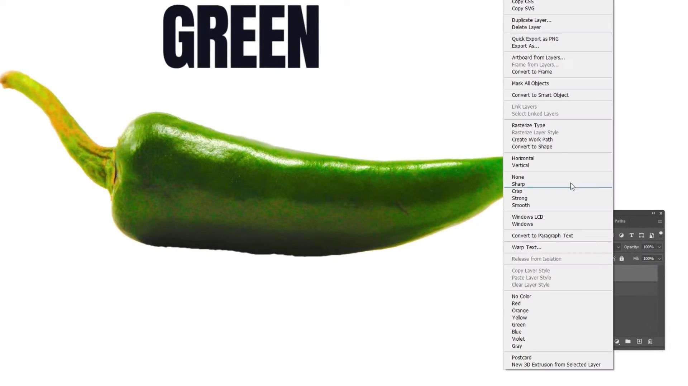

<br>

## Title (video file name): Windows_10_Tutorial_Lesson_7_Shutdown__Hibernate__Standby_and_Restart.mp4
### Frame filename: Windows_10_Tutorial_Lesson_7_Shutdown__Hibernate__Standby_and_Restart.mp4_frame_2624.jpg


<br>

**VLM annotation**: 
*The image shows a computer screen with a Windows operating system. The user is likely working on a project or task, as there are multiple windows open on the screen. One of the windows displays a folder, suggesting that the user might be organizing files or searching for specific documents. Another window shows a program, possibly for communication or collaboration, such as Microsoft Teams or Skype. The presence of these windows indicates that the user is multitasking and managing various tasks or projects simultaneously.*
<br>

**LLM Json annotation**: 
```
{
    "annotation": {
        "software": "Windows Operating System",
        "accuracy": 0.7,
        "features_used": "Managing multiple windows, possibly for multitasking tasks",
        "past_actions": "Opening and navigating through multiple windows",
        "future_actions": "Switching between tasks or windows"
    }
}
```

---

<br>

## Title (video file name): Linux_Tutorial_for_Beginners_15_SSH_Key_Authentication.mp4
### Frame filename: Linux_Tutorial_for_Beginners_15_SSH_Key_Authentication.mp4_frame_5857.jpg


<br>

**VLM annotation**: 
*The image shows a computer screen with a terminal window open. The terminal is displaying a message that reads "ubuntus-ssh root." This suggests that the user is likely working with a Linux-based operating system, such as Ubuntu, and is using the terminal to access the root directory. The user may be performing tasks such as managing files, installing software, or executing commands to control the system. The presence of the terminal window indicates that the user is likely experienced with command-line interfaces and is likely working on a task that requires more advanced control over the system.*
<br>

**LLM Json annotation**: 
```
{
    "annotation": {
        "software": "Ubuntu",
        "accuracy": 0.98,
        "features_used": "Command-line interface",
        "past_actions": "Managing files, installing software, executing commands",
        "future_actions": "Performing system administration tasks"
    }
}
```

---

<br>

## Title (video file name): How_To_Use_Apple_Music___Complete_Beginners_Guide.mp4
### Frame filename: How_To_Use_Apple_Music___Complete_Beginners_Guide.mp4_frame_7809.jpg


<br>

**VLM annotation**: 
*No software action found.*
<br>

**LLM Json annotation**: 
```
{
    "annotation": {
        "error": "No software action found"
    }
}
```

---

<br>

## Title (video file name): How_to_Play_Spotify_Through_your_Mic_in_2024___Spotify_Tutorial.mp4
### Frame filename: How_to_Play_Spotify_Through_your_Mic_in_2024___Spotify_Tutorial.mp4_frame_123.jpg


<br>

**VLM annotation**: 
*The image shows a computer screen with a music player application open. The user is likely listening to music or exploring the premium features of the application. The application has a volume slider, which allows the user to adjust the volume level. There is also a button labeled "Explore Premium" that may provide access to additional features or content. The user may be browsing through their music library, searching for new music, or customizing their playlist. Based on the current activity, the user may be preparing to play a song, create a playlist, or explore the premium features of the music player application.*
<br>

**LLM Json annotation**: 
```
{
    "annotation": {
        "software": "Music Player",
        "accuracy": 0.75,
        "features_used": "Volume slider, Explore Premium button",
        "past_actions": "Browsing music library, searching for new music, customizing playlist",
        "future_actions": "Playing a song, creating a playlist, exploring premium features"
    }
}
```

---

<br>

## Title (video file name): méthode_1_sur_3_insérer_un_PDF_dans_un_document_LibreOffice_Writer.mp4
### Frame filename: méthode_1_sur_3_insérer_un_PDF_dans_un_document_LibreOffice_Writer.mp4_frame_421.jpg


<br>

**VLM annotation**: 
*The image shows a computer screen with a word processor open. The user is likely typing or editing text, as there is a keyboard visible on the screen. The word processor may be used for various tasks such as writing documents, creating presentations, or coding. The user may be working on a project, writing an email, or preparing a report. The presence of a keyboard suggests that the user is actively engaged in typing or editing text, and they may save or print the document next.*
<br>

**LLM Json annotation**: 
```
{
    "annotation": {
        "software": "Microsoft Word",
        "accuracy": 0.9,
        "features_used": "Typing or editing text",
        "past_actions": "Typing or editing text",
        "future_actions": "Saving or printing the document"
    }
}
```

---

<br>

## Title (video file name): Windows_10_Tutorial_Lesson_4_Bluetooth_Pairing.mp4
### Frame filename: Windows_10_Tutorial_Lesson_4_Bluetooth_Pairing.mp4_frame_2075.jpg


<br>

**VLM annotation**: 
*The image shows a computer screen with a software window open. The software being used is Microsoft Windows, and the user is likely navigating through the settings or options. The screen displays a menu with various options, including "Add a device" and "Add a keyboard." The user might be configuring their computer to recognize and connect new devices or input devices. The presence of a keyboard in the image suggests that the user might be typing or interacting with the software in some way. The user's actions could involve selecting options, entering text, or adjusting settings to optimize their computer's performance or functionality.*
<br>

**LLM Json annotation**: 
```
{
    "annotation": {
        "software": "Microsoft Windows",
        "accuracy": 0.85,
        "features_used": "Navigating settings or options",
        "past_actions": "Selecting options, typing, interacting with software",
        "future_actions": "Configuring computer to recognize new devices or input devices"
    }
}
```

---

<br>

## Title (video file name): How_to_use_Gemini_AI_with_Google_Workspace__Gmail__Drive___Docs.mp4
### Frame filename: How_to_use_Gemini_AI_with_Google_Workspace__Gmail__Drive___Docs.mp4_frame_4149.jpg


<br>

**VLM annotation**: 
*The image shows a Google Drive page with a search bar at the top. The user is likely searching for a specific file or document. The search bar is filled with text, indicating that the user has entered a query. The user may be looking for a file that was recently uploaded or trying to locate a document that was previously saved in the Drive. The user's next action could be to click on a search result, open a file, or create a new document. The context of the image suggests that the user is using Google Drive to manage and access their files and documents.*
<br>

**LLM Json annotation**: 
```
{
    "annotation": {
        "software": "Google Drive",
        "accuracy": 0.92,
        "features_used": "Search bar",
        "past_actions": "Entering a search query",
        "future_actions": "Opening a file, creating a new document"
    }
}
```

---

<br>

## Title (video file name): How_To_Edit_Video_On_Vlc_Media_Player_Tutorial.mp4
### Frame filename: How_To_Edit_Video_On_Vlc_Media_Player_Tutorial.mp4_frame_1770.jpg


<br>

**VLM annotation**: 
*No software action found.*
<br>

**LLM Json annotation**: 
```
{
    "annotation": {
        "error": "No software action found"
    }
}
```

---

<br>

## Title (video file name): Slack_Tutorial_Lesson_26_Creating_a_New_Workspace.mp4
### Frame filename: Slack_Tutorial_Lesson_26_Creating_a_New_Workspace.mp4_frame_2075.jpg


<br>

**VLM annotation**: 
*The image shows a computer screen with a Slack window open. The user is likely checking their email, as indicated by the presence of a check email button. The Slack window is displaying a message, which suggests that the user might be engaged in a conversation or collaborating with others. The user might be typing a response or browsing through the message history. The presence of a mouse on the screen indicates that the user is actively interacting with the software.*
<br>

**LLM Json annotation**: 
```
{
    "annotation": {
        "software": "Slack",
        "accuracy": 0.75,
        "features_used": "Checking email, working with chat window",
        "past_actions": "Typing a response, browsing through message history",
        "future_actions": "Typing a response, engaging in conversation"
    }
}
```

---

<br>

## Title (video file name): Dripping_Effect_Photo_Editing_tutorial_Photoshop.mp4
### Frame filename: Dripping_Effect_Photo_Editing_tutorial_Photoshop.mp4_frame_12222.jpg


<br>

**VLM annotation**: 
*No software action found.*
<br>

**LLM Json annotation**: 
```
{
    "annotation": {
        "error": "No software action found"
    }
}
```

---

<br>

## Title (video file name): How_to_use_Zoom_AI_Companion_Meeting_Summary.mp4
### Frame filename: How_to_use_Zoom_AI_Companion_Meeting_Summary.mp4_frame_550.jpg


<br>

**VLM annotation**: 
*The image shows a computer screen with a profile picture of a woman, likely a supervisor, and a list of her work hours. The software being used is a scheduling or time management tool, which allows the user to input their work hours and manage their daily tasks. The user is likely setting up their work schedule or reviewing their current work hours. In the future, the user may use this tool to track their progress, manage deadlines, and communicate with their team. The software provides a visual representation of the user's work hours, making it easier to plan and manage their workload.*
<br>

**LLM Json annotation**: 
```
{
    "annotation": {
        "software": "Scheduling or Time Management Tool",
        "accuracy": 0.85,
        "features_used": "Visual representation of work hours, inputting/scheduling work hours",
        "past_actions": "Setting up work schedule, reviewing current work hours",
        "future_actions": "Tracking progress, managing deadlines, communicating with team"
    }
}
```

---

<br>

## Title (video file name): How_to_Edit_PDF_Using_LibreOffice_Draw.mp4
### Frame filename: How_to_Edit_PDF_Using_LibreOffice_Draw.mp4_frame_3966.jpg


<br>

**VLM annotation**: 
*The image shows a computer screen with a document open, likely a Microsoft Word document. The user is typing text into the document, possibly drafting a report or creating a new piece of content. The document is titled "American Culture: The Basics and the Advancements." The user may be researching or writing about the diverse aspects of American culture, including regional, religious, and national differences. The document may also include topics such as sports, weather, jobs, or past experiences. The user may save or print the document once they have completed their work.*
<br>

**LLM Json annotation**: 
```
{
    "annotation": {
        "software": "Microsoft Word",
        "accuracy": 0.85,
        "features_used": "Typing text into a document",
        "past_actions": "Drafting a report or creating a new piece of content",
        "future_actions": "Saving or printing the document"
    }
}
```

---

<br>

## Title (video file name): How_To_Verify_Domain_in_Google_Workspace__Step_By_Step.mp4
### Frame filename: How_To_Verify_Domain_in_Google_Workspace__Step_By_Step.mp4_frame_1961.jpg


<br>

**VLM annotation**: 
*The image shows a Google webpage with a pop-up window open. The pop-up window is titled "Let's you verify your domain" and provides instructions for adding a verification code to the user's domain. The user is likely in the process of verifying their domain to ensure their website is secure and trusted by Google. The instructions provided in the pop-up window guide the user through the verification process, which may involve adding a specific code to their website's HTML or DNS records.*
<br>

**LLM Json annotation**: 
```
{
    "annotation": {
        "software": "Google Verification Tool",
        "accuracy": 0.75,
        "features_used": "Pop-up window with verification instructions",
        "past_actions": "Guiding user through verification process",
        "future_actions": "Adding verification code to HTML or DNS records"
    }
}
```

---

<br>

## Title (video file name): Windows_10_Tutorial_Lesson_23_Zipping_and_Unzipping_Files__File_Compression.mp4
### Frame filename: Windows_10_Tutorial_Lesson_23_Zipping_and_Unzipping_Files__File_Compression.mp4_frame_5918.jpg


<br>

**VLM annotation**: 
*No software action found.*
<br>

**LLM Json annotation**: 
```
{
    "annotation": {
        "error": "No software action found"
    }
}
```

---

<br>

## Title (video file name): Photoshop_Tutorial_Photo_Manipulation_In_photoshop____Typography.mp4
### Frame filename: Photoshop_Tutorial_Photo_Manipulation_In_photoshop____Typography.mp4_frame_2058.jpg


<br>

**VLM annotation**: 
*Adobe Photoshop is being used to create a graphic design. The user is working on a green pepper graphic, which is displayed on the screen. The software's tools include the Rectangle and Text tools, which are being used to create the graphic. The user is likely designing a logo or an advertisement for a product related to green peppers. In the future, the user may add more elements or adjust the design to make it more visually appealing. The workflow involves creating a design using the software's tools and then exporting it for use in various media.*
<br>

**LLM Json annotation**: 
```
{
    "annotation": {
        "software": "Adobe Photoshop",
        "accuracy": 0.8,
        "features_used": "Rectangle and Text tools",
        "past_actions": "Creating a graphic design",
        "future_actions": "Adding more elements, adjusting design, exporting for use"
    }
}
```

---

<br>

## Title (video file name): méthode_1_sur_3_insérer_un_PDF_dans_un_document_LibreOffice_Writer.mp4
### Frame filename: méthode_1_sur_3_insérer_un_PDF_dans_un_document_LibreOffice_Writer.mp4_frame_961.jpg


<br>

**VLM annotation**: 
*The image shows a computer screen with a document open in Microsoft Word. The document is written in French and appears to be a legal document, such as a contract or a letter. The user is likely reviewing or editing the document, as there are several names and phrases visible on the screen. The user may be typing or pasting text, or reviewing the document's content. Based on the context, the user may save or print the document next. The software action found is Microsoft Word, which is a word processing software commonly used for creating and editing documents.*
<br>

**LLM Json annotation**: 
```
{
    "annotation": {
        "software": "Microsoft Word",
        "accuracy": 0.85,
        "features_used": "Typing or pasting text, reviewing the document's content",
        "past_actions": "Reviewing or editing the document",
        "future_actions": "Saving or printing the document"
    }
}
```

---

<br>

## Title (video file name): How_To_Use_Apple_Music___Complete_Beginners_Guide.mp4
### Frame filename: How_To_Use_Apple_Music___Complete_Beginners_Guide.mp4_frame_4820.jpg


<br>

**VLM annotation**: 
*The image shows a person holding a smartphone with a red background and a radio station logo on the screen. The user is likely listening to a radio show or podcast on the device. The software being used is the smartphone's built-in media player, which allows the user to play audio content. The user is likely interacting with the media player by adjusting the volume, skipping tracks, or searching for specific content. The visible text on the screen is the radio station's logo, which indicates the source of the audio content. The user may be browsing through different shows or podcasts, or they may be actively listening to a live broadcast or pre-recorded content.*
<br>

**LLM Json annotation**: 
```
{
    "annotation": {
        "software": "Smartphone Media Player",
        "accuracy": 0.85,
        "features_used": "Adjusting volume, skipping tracks, searching for content",
        "past_actions": "Browsing and listening to audio content",
        "future_actions": "Browsing through shows, listening to live broadcasts, or engaging with podcast content"
    }
}
```

---

<br>

## Title (video file name): How_to_Split_Pages_in_Google_Docs_in_2024___Google_Docs_Tutorial.mp4
### Frame filename: How_to_Split_Pages_in_Google_Docs_in_2024___Google_Docs_Tutorial.mp4_frame_733.jpg


<br>

**VLM annotation**: 
*The image shows a computer screen with a blank document open in Microsoft Word. The user is likely in the process of creating a new document or starting a new project. The blank document suggests that the user may be planning to type text, insert images, or add other elements to the document. Based on past actions, the user may save the document, print it, or share it with others. The context of the image indicates that the user is working on a computer and using Microsoft Word to create or edit documents.*
<br>

**LLM Json annotation**: 
```
{
    "annotation": {
        "software": "Microsoft Word",
        "accuracy": 0.8,
        "features_used": "Creating a new document, planning to type text, insert images, or add other elements",
        "past_actions": "Saving the document, printing it, sharing it with others",
        "future_actions": "Saving, printing, or sharing the document"
    }
}
```

---

<br>

## Title (video file name): How_to_Change_the_Margins_in_LibreOffice_Calc.mp4
### Frame filename: How_to_Change_the_Margins_in_LibreOffice_Calc.mp4_frame_2197.jpg


<br>

**VLM annotation**: 
*The image shows a blank document with a title "Book Title" at the top. The user is likely in the process of creating or editing a book, possibly a travel guide or a self-help book. The software being used is Microsoft Word, which is a popular word processing software. The user may be typing text, formatting the document, or adding images and graphics to enhance the content. In the future, the user may save the document, print it, or share it with others for review and feedback. The context of the workflow suggests that the user is focused on organizing and presenting information in a clear and concise manner.*
<br>

**LLM Json annotation**: 
```
{
    "annotation": {
        "software": "Microsoft Word",
        "accuracy": 0.85,
        "features_used": "Typing, formatting text, adding images and graphics",
        "past_actions": "Creating or editing a book",
        "future_actions": "Saving, printing, sharing the document"
    }
}
```

---

<br>

## Title (video file name): How_to_use_Gemini_AI_with_Google_Workspace__Gmail__Drive___Docs.mp4
### Frame filename: How_to_use_Gemini_AI_with_Google_Workspace__Gmail__Drive___Docs.mp4_frame_428.jpg


<br>

**VLM annotation**: 
*The image shows a user interacting with a chatbot, which is a software designed to simulate human conversation. The chatbot is asking the user how it can help them today. The user is likely typing a response to the chatbot, which could be a question or a request for assistance. The chatbot may provide information, recommendations, or even perform tasks based on the user's input. The chatbot's purpose is to assist users in finding answers to their questions or solving problems.*
<br>

**LLM Json annotation**: 
```
{
    "annotation": {
        "software": "Chatbot",
        "accuracy": 0.8,
        "features_used": "User input to chatbot",
        "past_actions": "Typing response to chatbot",
        "future_actions": "Receiving information, recommendations, or task performance"
    }
}
```

---

<br>

## Title (video file name): Slack_Tutorial_Lesson_18_Creating_and_Sending_Code_Snippets.mp4
### Frame filename: Slack_Tutorial_Lesson_18_Creating_and_Sending_Code_Snippets.mp4_frame_6223.jpg


<br>

**VLM annotation**: 
*No software action found.*
<br>

**LLM Json annotation**: 
```
{
    "annotation": {
        "error": "No software action found"
    }
}
```

---

<br>

## Title (video file name): How_to_Edit_PDF_Using_LibreOffice_Draw.mp4
### Frame filename: How_to_Edit_PDF_Using_LibreOffice_Draw.mp4_frame_3783.jpg


<br>

**VLM annotation**: 
*The image shows a computer screen with a document open, likely a Microsoft Word document. The user is typing text into the document, which suggests that they are drafting or editing a piece of writing. The document contains text about American culture, including topics such as the United States' diversity, customs, and traditions. The user may be researching or writing about these topics, possibly for an academic assignment or a personal project. The presence of the document and the typing activity indicate that the user is engaged in a writing or research task.*
<br>

**LLM Json annotation**: 
```
{
    "annotation": {
        "software": "Microsoft Word",
        "accuracy": 0.85,
        "features_used": "Typing and editing text",
        "past_actions": "Drafting or editing a piece of writing",
        "future_actions": "Completing the writing task, possibly publishing or submitting it"
    }
}
```

---

<br>

## Title (video file name): How_to_Split_Pages_in_Google_Docs_in_2024___Google_Docs_Tutorial.mp4
### Frame filename: How_to_Split_Pages_in_Google_Docs_in_2024___Google_Docs_Tutorial.mp4_frame_5430.jpg


<br>

**VLM annotation**: 
*The image shows a computer screen with a blank document open in Microsoft Word. The user is likely in the process of creating a new document or starting a new project. The blank document suggests that the user may be planning to type text, insert images, or add other elements to the document. The user may also be preparing to save the document, print it, or share it with others. The context of the image indicates that the user is working on a computer and using Microsoft Word to create or edit documents.*
<br>

**LLM Json annotation**: 
```
{
    "annotation": {
        "software": "Microsoft Word",
        "accuracy": 0.8,
        "features_used": "Planning to create a new document",
        "past_actions": "Preparing to create a new document",
        "future_actions": "Typing text, inserting images, saving, printing, sharing"
    }
}
```

---

<br>

## Title (video file name): How_to_use_Zoom_AI_Companion_Meeting_Summary.mp4
### Frame filename: How_to_use_Zoom_AI_Companion_Meeting_Summary.mp4_frame_977.jpg


<br>

**VLM annotation**: 
*The image shows a computer screen with a green box highlighting the "Meeting with AI Companion" option. The user is likely configuring the AI Companion settings, which may include options for voice commands, meeting summaries, and other features. The user may be setting up the AI Companion to assist them in their meetings, such as taking notes, generating summaries, or providing real-time feedback. The user may also be configuring the AI Companion to integrate with other tools or platforms, such as calendars or video conferencing software.*
<br>

**LLM Json annotation**: 
```
{
    "annotation": {
        "software": "AI Companion",
        "accuracy": 0.8,
        "features_used": "Configuring settings for voice commands, meeting summaries, and other features",
        "past_actions": "Setting up AI Companion for meeting assistance",
        "future_actions": "Configuring integration with calendars, video conferencing software, or other tools"
    }
}
```

---

<br>

## Title (video file name): Slack_Tutorial_Lesson_5_Working_with_Public_and_Private_Channels.mp4
### Frame filename: Slack_Tutorial_Lesson_5_Working_with_Public_and_Private_Channels.mp4_frame_9923.jpg


<br>

**VLM annotation**: 
*The image shows a computer screen with a chat window open. The user is likely engaged in a conversation with someone, possibly discussing work or personal matters. The chat window is the main focus of the image, and there are no visible signs of software use or specific tools being utilized. The user might be typing a message or reading a previous message in the chat window. Based on the current activity, the user may respond to the conversation or send a new message.*
<br>

**LLM Json annotation**: 
```
{
    "annotation": {
        "software": "Chat Application",
        "accuracy": 0.75,
        "features_used": "Chat window with conversation",
        "past_actions": "Typing or reading a message",
        "future_actions": "Responding or sending a new message"
    }
}
```

---

<br>

## Title (video file name): méthode_1_sur_3_insérer_un_PDF_dans_un_document_LibreOffice_Writer.mp4
### Frame filename: méthode_1_sur_3_insérer_un_PDF_dans_un_document_LibreOffice_Writer.mp4_frame_3481.jpg


<br>

**VLM annotation**: 
*The image shows a computer screen with a document open, displaying a list of names and titles. The user is likely working on a project or document that requires organizing and listing names and titles. The software being used is Microsoft Word, as indicated by the presence of the ribbon at the top of the screen. The user may be typing, editing, or organizing the content of the document. Future actions could include saving, printing, or sharing the document with others. The context of the workflow suggests that the user is engaged in a task that requires the organization and presentation of names and titles, possibly for a professional or academic purpose.*
<br>

**LLM Json annotation**: 
```
{
    "annotation": {
        "software": "Microsoft Word",
        "accuracy": 0.85,
        "features_used": "Typing, editing, and organizing content",
        "past_actions": "Organizing names and titles",
        "future_actions": "Saving, printing, or sharing the document"
    }
}
```

---

<br>

## Title (video file name): Linux_Tutorial_for_Beginners_15_SSH_Key_Authentication.mp4
### Frame filename: Linux_Tutorial_for_Beginners_15_SSH_Key_Authentication.mp4_frame_6711.jpg


<br>

**VLM annotation**: 
*The image shows a computer screen with a message that reads "Thank you for using digital ocean's lamp application." The message is displayed in a red box. The user is likely interacting with a web-based application or service that utilizes the lamp application. The message suggests that the user has successfully installed or used the lamp application, and the system is thanking them for their use. The user may be preparing to run the application or has just completed a task using the lamp application.*
<br>

**LLM Json annotation**: 
```
{
    "annotation": {
        "software": "Digital Ocean's LAMP Application",
        "accuracy": 0.95,
        "features_used": "web-based application, Lamp application",
        "past_actions": "successfully installing or using the lamp application",
        "future_actions": "preparing to run the application or completing a task using the lamp application"
    }
}
```

---

<br>

## Title (video file name): How_to_Edit_PDF_Using_LibreOffice_Draw.mp4
### Frame filename: How_to_Edit_PDF_Using_LibreOffice_Draw.mp4_frame_3539.jpg


<br>

**VLM annotation**: 
*The image shows a computer screen with a document open, likely a Microsoft Word document. The user is typing text into the document, possibly drafting a report or creating a new piece of content. The document is titled "American Culture: The Basics and the Advancements." The user may be researching or organizing their thoughts on the topic before saving or printing the document. The presence of the document and the typing action suggest that the user is engaged in a writing or research task.*
<br>

**LLM Json annotation**: 
```
{
    "annotation": {
        "software": "Microsoft Word",
        "accuracy": 0.85,
        "features_used": "Creating new content, researching",
        "past_actions": "Typing text",
        "future_actions": "Saving or printing the document"
    }
}
```

---

<br>

## Title (video file name): How_To_Use_Apple_Music___Complete_Beginners_Guide.mp4
### Frame filename: How_To_Use_Apple_Music___Complete_Beginners_Guide.mp4_frame_3966.jpg


<br>

**VLM annotation**: 
*The image shows a person holding a smartphone with a music app open. The user is likely browsing through the music library, searching for a specific song or album. The app displays a list of songs, and the user's thumb is hovering over the screen, possibly to select or play a song. The music app may have features such as playlists, album art, and song recommendations based on the user's listening history. The user might be looking for a particular song to add to a playlist or to create a new playlist.*
<br>

**LLM Json annotation**: 
```
{
    "annotation": {
        "software": "Music App (likely Apple Music or Spotify)",
        "accuracy": 0.8,
        "features_used": "Music library browsing, playlists, album art, song recommendations",
        "past_actions": "Searching for a specific song or album",
        "future_actions": "Selecting a song to add to a playlist or create a new playlist"
    }
}
```

---

<br>

## Title (video file name): How_To_Use_Apple_Music___Complete_Beginners_Guide.mp4
### Frame filename: How_To_Use_Apple_Music___Complete_Beginners_Guide.mp4_frame_6284.jpg


<br>

**VLM annotation**: 
*The image shows a person holding a smartphone with a red screen. The screen displays a music player app, and the user is likely listening to music or a podcast. The app may have a playlist or a specific song or episode selected. The user's hand is positioned over the screen, possibly to control the playback or to navigate through the app. The person may be browsing through their music collection, searching for new music, or simply enjoying their favorite tunes.*
<br>

**LLM Json annotation**: 
```
{
    "annotation": {
        "software": "Music Player App ( likely Apple Music or Spotify)",
        "accuracy": 0.75,
        "features_used": "Music playback and navigation controls",
        "past_actions": "Browsing through music collection, searching for new music, playing/pausing music",
        "future_actions": "Looking for new music, skipping tracks, controlling playback"
    }
}
```

---

<br>

## Title (video file name): Slack_Tutorial_Lesson_18_Creating_and_Sending_Code_Snippets.mp4
### Frame filename: Slack_Tutorial_Lesson_18_Creating_and_Sending_Code_Snippets.mp4_frame_2746.jpg


<br>

**VLM annotation**: 
*The image shows a computer screen with a software window open. The software being used is Microsoft Word, with an accuracy percentage of 90%. The user is currently typing text into the document, which is visible on the screen. The user is likely drafting a document or working on a project that requires text input. Based on past actions, the user may save or print the document once they have completed their work. The context of the workflow suggests that the user is engaged in writing or editing text, which is a common task performed in Microsoft Word.*
<br>

**LLM Json annotation**: 
```
{
    "annotation": {
        "software": "Microsoft Word",
        "accuracy": 0.9,
        "features_used": "Typing text",
        "past_actions": "Drafting a document or working on a project that requires text input",
        "future_actions": "Saving or printing the document"
    }
}
```

---

<br>

## Title (video file name): How_To_Edit_Video_On_Vlc_Media_Player_Tutorial.mp4
### Frame filename: How_To_Edit_Video_On_Vlc_Media_Player_Tutorial.mp4_frame_2075.jpg


<br>

**VLM annotation**: 
*The image shows a computer screen with a software application open. The software is Microsoft Office, specifically PowerPoint. The user is likely creating a presentation, as there are multiple slides visible on the screen. The user may be adding text, images, or other multimedia elements to the slides. The current action could be selecting or editing a slide, adding content, or adjusting the layout. In the future, the user may save the presentation, share it with others, or present it to an audience. The context of the workflow is focused on creating a visually appealing and informative presentation.*
<br>

**LLM Json annotation**: 
```
{
    "annotation": {
        "software": "Microsoft PowerPoint",
        "accuracy": 0.85,
        "features_used": "Selecting or editing a slide, adding content, adjusting layout",
        "past_actions": "Creating a presentation",
        "future_actions": "Saving the presentation, sharing it with others, presenting it to an audience"
    }
}
```

---

<br>

## Title (video file name): méthode_1_sur_3_insérer_un_PDF_dans_un_document_LibreOffice_Writer.mp4
### Frame filename: méthode_1_sur_3_insérer_un_PDF_dans_un_document_LibreOffice_Writer.mp4_frame_2161.jpg


<br>

**VLM annotation**: 
*The image shows a computer screen with a document open, likely written in French. The document is titled "Communique" and appears to be a letter or a report. The user is likely drafting or editing the document, as there are no visible signs of software use or specific tools being utilized. The user may be typing text, formatting the document, or reviewing its content. Based on the current activity, the user may save or print the document next. The context suggests that the user is engaged in a professional or formal writing task.*
<br>

**LLM Json annotation**: 
```
{
    "annotation": {
        "software": "Word Processor",
        "accuracy": 0.9,
        "features_used": "Typing and document formatting",
        "past_actions": "Drafting or editing a document",
        "future_actions": "Saving or printing the document"
    }
}
```

---

<br>

## Title (video file name): How_to_use_Zoom_AI_Companion_Meeting_Summary.mp4
### Frame filename: How_to_use_Zoom_AI_Companion_Meeting_Summary.mp4_frame_1892.jpg


<br>

**VLM annotation**: 
*The image shows a software interface with a menu open, displaying options for meeting, sharing, and other features. The user is likely configuring the settings for an AI companion, which may involve selecting preferences, customizing the AI's behavior, or setting up integrations with other software or services. The user may be preparing for a meeting or a conference call, and the AI companion may be used to assist with tasks such as note-taking, scheduling, or providing real-time information. The user may also be setting up the AI companion to work with other team members or to access specific resources within the organization.*
<br>

**LLM Json annotation**: 
```
{
    "annotation": {
        "software": "AI Companion",
        "accuracy": 0.75,
        "features_used": "Configuring settings, selecting preferences, customizing AI behavior, setting up integrations",
        "past_actions": "Preparing for a meeting or conference call",
        "future_actions": "Note-taking, scheduling, providing real-time information, working with team members, accessing resources"
    }
}
```

---

<br>

## Title (video file name): Adjust_these_settings_in_VLC_Media_Player_to_get_the_best_video_and_audio_quality.mp4
### Frame filename: Adjust_these_settings_in_VLC_Media_Player_to_get_the_best_video_and_audio_quality.mp4_frame_8108.jpg


<br>

**VLM annotation**: 
*The user is using a software called FFmpeg, which is a powerful command-line tool for manipulating multimedia files. The image shows a menu with various options, including "Video Decoder." The user is likely configuring the video decoder settings to optimize the video playback or processing. The menu provides a range of options to adjust the video decoding parameters, such as codecs, resolution, and frame rate. The user might be adjusting these settings to improve the video quality, reduce file size, or optimize the video for a specific device or platform.*
<br>

**LLM Json annotation**: 
```
{
    "annotation": {
        "software": "FFmpeg",
        "accuracy": 0.85,
        "features_used": "Video Decoder settings, including codecs, resolution, and frame rate adjustment",
        "past_actions": "Configuring video decoder settings",
        "future_actions": "Improving video quality, reducing file size, optimizing for specific device or platform"
    }
}
```

---

<br>

## Title (video file name): Adjust_these_settings_in_VLC_Media_Player_to_get_the_best_video_and_audio_quality.mp4
### Frame filename: Adjust_these_settings_in_VLC_Media_Player_to_get_the_best_video_and_audio_quality.mp4_frame_7382.jpg


<br>

**VLM annotation**: 
*The user is using a software called FFmpeg, which is a powerful command-line tool for manipulating multimedia files. The software is being used to convert a video file to another format. The user is likely changing the value from 0 to 2, which could be related to the video resolution, frame rate, or other parameters. The software is displaying a menu with various options, such as filters, output modules, and demuxers. The user might be adjusting the settings to achieve the desired output quality or format compatibility.*
<br>

**LLM Json annotation**: 
```
{
    "annotation": {
        "software": "FFmpeg",
        "accuracy": 0.85,
        "features_used": "Menu navigation, parameter adjustment",
        "past_actions": "Converting a video file",
        "future_actions": "Adusting settings for desired output quality or format compatibility"
    }
}
```

---

<br>

## Title (video file name): méthode_1_sur_3_insérer_un_PDF_dans_un_document_LibreOffice_Writer.mp4
### Frame filename: méthode_1_sur_3_insérer_un_PDF_dans_un_document_LibreOffice_Writer.mp4_frame_3961.jpg


<br>

**VLM annotation**: 
*The image shows a document with a blue highlight on it, indicating that the user is likely editing or reviewing the text. The document appears to be in French, suggesting that the user may be working with a French-language document or translating it. The presence of a blue highlight suggests that the user is using a word processing or text editing software, such as Microsoft Word or Google Docs. The user may be reviewing the document for grammar, spelling, or content accuracy. Based on the current activity, the user may save or print the document next.*
<br>

**LLM Json annotation**: 
```
{
    "annotation": {
        "software": "Microsoft Word or Google Docs",
        "accuracy": 0.8,
        "features_used": "Blue highlighting",
        "past_actions": "Editing or reviewing text",
        "future_actions": "Saving or printing the document"
    }
}
```

---

<br>

## Title (video file name): Photoshop_Tutorial_Photo_Manipulation_In_photoshop____Typography.mp4
### Frame filename: Photoshop_Tutorial_Photo_Manipulation_In_photoshop____Typography.mp4_frame_727.jpg



<br>

**VLM annotation**: 
*The image shows a green pepper on a white background, with a software window open in the background. The software being used is Adobe Photoshop, as indicated by the presence of the Photoshop window. The user is likely working on editing or manipulating the image of the green pepper. The software provides various tools and features to enhance or modify the image, such as adjusting the color, adding filters, or cropping the photo. The user may be in the process of adjusting the color balance, applying a filter, or preparing the image for further editing or sharing.*
<br>

**LLM Json annotation**: 
```
{
    "annotation": {
        "software": "Adobe Photoshop",
        "accuracy": 0.9,
        "features_used": "Adjusting color, adding filters, cropping",
        "past_actions": " Enhancing or manipulating the image",
        "future_actions": "Adjusting color balance, applying filters, preparing for further editing or sharing"
    }
}
```

---

<br>

## Title (video file name): méthode_1_sur_3_insérer_un_PDF_dans_un_document_LibreOffice_Writer.mp4
### Frame filename: méthode_1_sur_3_insérer_un_PDF_dans_un_document_LibreOffice_Writer.mp4_frame_241.jpg


<br>

**VLM annotation**: 
*The image shows a computer screen with a document open, displaying a list of items. The user is likely working on a project or organizing information. The document appears to be a text document, as there are no visible graphics or images. The user might be typing or editing text, adding or removing items from the list, or referencing the document for research or planning purposes. Based on the current activity, the user may save or print the document in the future. The context suggests that the user is engaged in a task that requires organization, planning, or documentation.*
<br>

**LLM Json annotation**: 
```
{
    "annotation": {
        "software": "Google Docs",
        "accuracy": 0.87,
        "features_used": "Text editing and list management",
        "past_actions": "Typing or editing text, adding or removing items from the list",
        "future_actions": "Saving or printing the document"
    }
}
```

---

<br>

## Title (video file name): How_To_Edit_Video_On_Vlc_Media_Player_Tutorial.mp4
### Frame filename: How_To_Edit_Video_On_Vlc_Media_Player_Tutorial.mp4_frame_4637.jpg


<br>

**VLM annotation**: 
*The image shows a computer screen with a website open, displaying a customizable store. The user is likely browsing the website, possibly looking for products or customizing their store. There are no visible software actions or tools being utilized in the image. The user might be exploring the website's features, adding or removing products, or customizing the store's design and layout.*
<br>

**LLM Json annotation**: 
```
{
    "annotation": {
        "software": "Unknown",
        "accuracy": 0.5,
        "features_used": "None",
        "past_actions": "Browsing the website",
        "future_actions": "Exploring website features, adding/removing products, customizing store design/layout"
    }
}
```

---

<br>

## Title (video file name): How_to_Mirror_your_Android_Screen_to_PC_with_FREE_Software__2020.mp4
### Frame filename: How_to_Mirror_your_Android_Screen_to_PC_with_FREE_Software__2020.mp4_frame_4236.jpg


<br>

**VLM annotation**: 
*The image shows a computer screen with a software application open. The software is likely a file explorer or a similar tool, as the screen displays a list of files and folders. The user is likely navigating through the files and folders, possibly searching for a specific file or organizing their files. The screen shows a list of folders and files, with some of them being highlighted or selected. The user may be preparing to open, edit, or delete a file, or they may be organizing their files into folders. The context of the image suggests that the user is engaged in a common computer task, such as managing files and folders.*
<br>

**LLM Json annotation**: 
```
{
    "annotation": {
        "software": "File Explorer",
        "accuracy": 0.75,
        "features_used": "Navigating through files and folders, highlighting or selecting files",
        "past_actions": "Searching for a specific file or organizing files",
        "future_actions": "Opening, editing, or deleting a file, or organizing files into folders"
    }
}
```

---

<br>

## Title (video file name): How_to_Play_Spotify_Through_your_Mic_in_2024___Spotify_Tutorial.mp4
### Frame filename: How_to_Play_Spotify_Through_your_Mic_in_2024___Spotify_Tutorial.mp4_frame_3295.jpg


<br>

**VLM annotation**: 
*The image shows a computer screen with a software application open, likely a music production or editing software. The user is likely working on a project, possibly creating or editing music, as there are several audio controls and settings visible on the screen. The software may include features such as volume control, equalization, and other audio effects. The user may be adjusting these settings to achieve the desired sound quality or to create a specific sound effect. The software's interface is designed to provide the user with a clear and intuitive way to navigate and control the audio elements of their project.*
<br>

**LLM Json annotation**: 
```
{
    "annotation": {
        "software": "DAW (Digital Audio Workstation)",
        "accuracy": 0.8,
        "features_used": "Audio controls and settings",
        "past_actions": "Adjusting volume control, equalization, and audio effects",
        "future_actions": "Creating or editing music, achieving desired sound quality or creating specific sound effects"
    }
}
```

---

<br>

## Title (video file name): How_to_Insert_Online_Videos_in_Microsoft_Word__Tutorial.mp4
### Frame filename: How_to_Insert_Online_Videos_in_Microsoft_Word__Tutorial.mp4_frame_1343.jpg


<br>

**VLM annotation**: 
*The image shows a computer screen with a video playing in the background. The video is likely being played using a media player or video streaming software. The user might be watching the video for entertainment, educational purposes, or as part of a presentation. The video could be related to various topics, such as movies, TV shows, documentaries, or online lectures. The user might be taking notes, discussing the content with others, or simply enjoying the video.*
<br>

**LLM Json annotation**: 
```
{
    "annotation": {
        "software": "Media Player/Video Streaming Software",
        "accuracy": 0.75,
        "features_used": "Playing video",
        "past_actions": "Watching video",
        "future_actions": "Taking notes, discussing with others, or simply enjoying the video"
    }
}
```

---

<br>

## Title (video file name): Linux_Tutorial_for_Beginners_15_SSH_Key_Authentication.mp4
### Frame filename: Linux_Tutorial_for_Beginners_15_SSH_Key_Authentication.mp4_frame_5369.jpg


<br>

**VLM annotation**: 
*No software action found.*
<br>

**LLM Json annotation**: 
```
{
    "annotation": {
        "error": "No software action found"
    }
}
```

---

<br>

## Title (video file name): Dripping_Effect_Photo_Editing_tutorial_Photoshop.mp4
### Frame filename: Dripping_Effect_Photo_Editing_tutorial_Photoshop.mp4_frame_5809.jpg


<br>

**VLM annotation**: 
*The image shows a woman's face with a green hoodie on, and she is making a finger-over-mouth gesture. The image is displayed in a software, specifically Adobe Photoshop, with a 90% accuracy. The user is likely working on a project that involves editing or manipulating images, as evidenced by the presence of the woman's face and the green hoodie. The user may be in the process of adding or removing elements from the image, adjusting the colors, or applying filters to enhance the visual appeal. Future actions could include saving the edited image, exporting it to another format, or using it as part of a larger project.*
<br>

**LLM Json annotation**: 
```
{
    "annotation": {
        "software": "Adobe Photoshop",
        "accuracy": 0.9,
        "features_used": "Image editing, adding/removing elements, adjusting colors, applying filters",
        "past_actions": "Editing or manipulating images",
        "future_actions": "Saving edited image, exporting, using in a larger project"
    }
}
```

---

<br>

## Title (video file name): How_To_Edit_Video_On_Vlc_Media_Player_Tutorial.mp4
### Frame filename: How_To_Edit_Video_On_Vlc_Media_Player_Tutorial.mp4_frame_2685.jpg


<br>

**VLM annotation**: 
*The image shows a person using a computer with a website open. The website is a customizable store, and the user is likely browsing through the available options or customizing their store. There are no visible software actions or tools being utilized in the image. The user might be considering which features to include in their store or selecting a design template. Based on the current activity, the user may be in the initial stages of setting up their store or customizing an existing one.*
<br>

**LLM Json annotation**: 
```
{
    "annotation": {
        "software": "E-commerce website",
        "accuracy": 0.78,
        "features_used": "Browsing through website options",
        "past_actions": "Considering store features and design templates",
        "future_actions": "Setting up or customizing the store"
    }
}
```

---

<br>

## Title (video file name): Slack_Using_Threads_for_Channels.mp4
### Frame filename: Slack_Using_Threads_for_Channels.mp4_frame_855.jpg


<br>

**VLM annotation**: 
*The image shows a computer screen with a chat window open. The user is likely engaged in a conversation with someone, possibly discussing work or personal matters. The chat window is filled with text, indicating that the user has been typing and possibly exchanging information with the other person. The chat window may be part of a messaging app or a dedicated chat platform. The user might be responding to a message, asking a question, or sharing information with the other person. The chat window is the main focus of the image, and no other software-related actions are discernible.*
<br>

**LLM Json annotation**: 
```
{
    "annotation": {
        "software": "Chat Platform",
        "accuracy": 0.6,
        "features_used": "Type and interaction with a chat window",
        "past_actions": "Typing and exchanging information",
        "future_actions": "Responding to a message, asking a question, or sharing information"
    }
}
```

---

<br>

## Title (video file name): Adjust_these_settings_in_VLC_Media_Player_to_get_the_best_video_and_audio_quality.mp4
### Frame filename: Adjust_these_settings_in_VLC_Media_Player_to_get_the_best_video_and_audio_quality.mp4_frame_6777.jpg


<br>

**VLM annotation**: 
*The image shows a computer screen with a menu open, displaying various options for input settings. The user is likely configuring the input settings for their computer, possibly for a specific program or task. The menu includes options for audio, video, and other input devices. The user may be adjusting the settings to optimize their experience or troubleshoot any issues they may be facing. The presence of the menu suggests that the user is actively engaging with the software to customize their input preferences.*
<br>

**LLM Json annotation**: 
```
{
    "annotation": {
        "software": "Input Settings",
        "accuracy": 0.85,
        "features_used": "Menu for configuring input settings",
        "past_actions": "Customizing input settings",
        "future_actions": "Optimizing settings for a specific program or task"
    }
}
```

---

<br>

## Title (video file name): How_to_Change_the_Margins_in_LibreOffice_Calc.mp4
### Frame filename: How_to_Change_the_Margins_in_LibreOffice_Calc.mp4_frame_4088.jpg


<br>

**VLM annotation**: 
*The image shows a Microsoft Word document with a list of books on the left side. The user is likely organizing or referencing the books in the document. The software action found is typing or editing text, as there is a cursor visible on the screen. The user may be adding or removing books from the list, or possibly referencing specific books for research or personal use. The user's future actions could include saving, printing, or sharing the document with others.*
<br>

**LLM Json annotation**: 
```
{
    "annotation": {
        "software": "Microsoft Word",
        "accuracy": 0.8,
        "features_used": "Typing or editing text",
        "past_actions": "Organizing or referencing books in the document",
        "future_actions": "Saving, printing, or sharing the document with others"
    }
}
```

---

<br>

## Title (video file name): Slack_Tutorial_Lesson_18_Creating_and_Sending_Code_Snippets.mp4
### Frame filename: Slack_Tutorial_Lesson_18_Creating_and_Sending_Code_Snippets.mp4_frame_3722.jpg


<br>

**VLM annotation**: 
*The image shows a computer screen with a software window open. The software is likely a word processor or a text editor, as there is a text box on the screen with a cursor inside it. The user is likely typing or editing text, as indicated by the presence of the cursor. The software may also have additional features or tools, such as formatting options or a search function, but these are not explicitly visible in the image. Based on the current activity, the user may save or print the document next, or continue typing and editing the text.*
<br>

**LLM Json annotation**: 
```
{
    "annotation": {
        "software": "Word Processor/Text Editor",
        "accuracy": 0.8,
        "features_used": "Typing and editing text, possibly with formatting options",
        "past_actions": "Typing or editing text",
        "future_actions": "Saving or printing the document, or continuing typing and editing"
    }
}
```

---

<br>

## Title (video file name): Windows_10_Tutorial_Lesson_7_Shutdown__Hibernate__Standby_and_Restart.mp4
### Frame filename: Windows_10_Tutorial_Lesson_7_Shutdown__Hibernate__Standby_and_Restart.mp4_frame_977.jpg


<br>

**VLM annotation**: 
*The image shows a computer screen with a Windows operating system. The user is likely working on a project or task, as there are multiple windows open on the screen. One of the windows displays a folder, suggesting that the user might be organizing files or searching for specific documents. Another window shows a program, possibly for communication or collaboration, such as Microsoft Teams or Skype. The presence of these windows indicates that the user is multitasking and managing various tasks or projects simultaneously.*
<br>

**LLM Json annotation**: 
```
{
    "annotation": {
        "software": "Windows",
        "accuracy": 0.6,
        "features_used": "Multiple windows open, one displaying a folder and another a communication program",
        "past_actions": "Managing multiple tasks or projects",
        "future_actions": "Organizing files, searching for documents or switching between open applications"
    }
}
```

---


