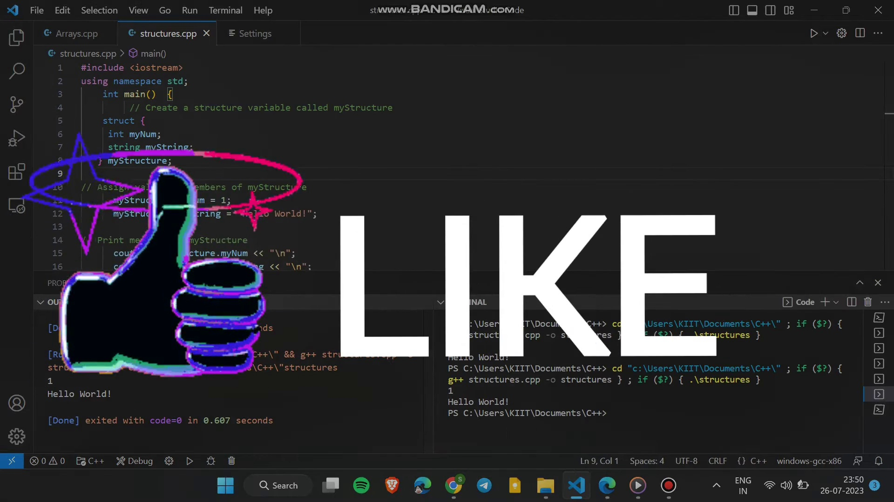
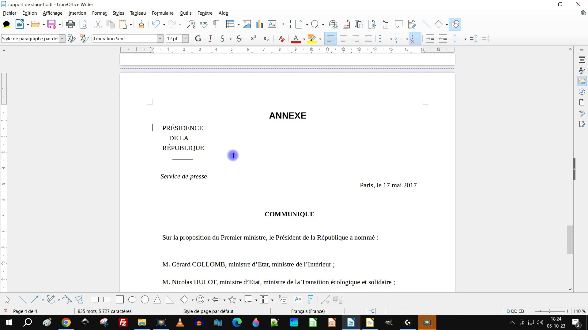
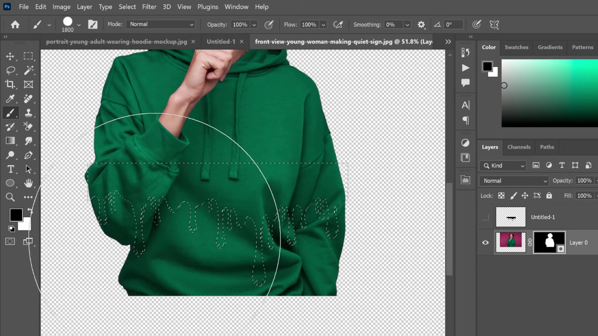

<br>

## Title (video file name): How_to_run_code_in_terminal_in_VS_code___Visual_studio_Code.mp4
### Frame filename: How_to_run_code_in_terminal_in_VS_code___Visual_studio_Code.mp4_frame_2197.jpg



<br>

**VLM annotation**: 
*The image shows a computer screen with a software called Visual Studio Code (VSC) open. The user is likely working on a coding project, as there are several lines of code visible on the screen. The user may be typing or editing code, as there is a cursor on the screen. The software provides a variety of features and tools for coding, such as syntax highlighting, debugging, and code completion. The user may be working on a web application, a desktop application, or any other type of software development project. Based on the current activity, the user may be in the process of writing, editing, or debugging code, and may save or compile their work in the near future.*
<br>

**LLM Json annotation**: 
```
{
    "annotation": {
        "software": "Visual Studio Code",
        "accuracy": 0.9,
        "features_used": "Syntax highlighting, debugging, and code completion",
        "past_actions": "Typing or editing code",
        "future_actions": "Saving or compiling the code"
    }
}
```

---

<br>

## Title (video file name): Photoshop_Tutorial_Photo_Manipulation_In_photoshop____Typography.mp4
### Frame filename: Photoshop_Tutorial_Photo_Manipulation_In_photoshop____Typography.mp4_frame_1332.jpg


<br>

**VLM annotation**: 
*Adobe Photoshop is being used to create a graphic design. The user is working on a green pepper graphic, which is placed on a white background. The software is displaying a ruler, indicating that the user is measuring or aligning elements within the design. The user is likely in the process of creating or editing the graphic, possibly for a marketing campaign or a digital art project. Future actions could include adjusting the size, color, or position of the pepper, adding text or other design elements, or saving the final design for use in various media.*
<br>

**LLM Json annotation**: 
```
{
    "annotation": {
        "software": "Adobe Photoshop",
        "accuracy": 0.9,
        "features_used": "Using a ruler",
        "past_actions": "Creating or editing a graphic",
        "future_actions": "Adjusting the size, color, or position of the pepper, adding text or other design elements, or saving the final design"
    }
}
```

---

<br>

## Title (video file name): Linux_Tutorial_for_Beginners_15_SSH_Key_Authentication.mp4
### Frame filename: Linux_Tutorial_for_Beginners_15_SSH_Key_Authentication.mp4_frame_2197.jpg


<br>

**VLM annotation**: 
*The image shows a computer screen with a blank purple background. There is no visible software or any specific actions being performed by the user. It is not possible to determine the user's intent or activity based on the image alone.*
<br>

**LLM Json annotation**: 
```
{
    "annotation": {
        "software": "Unknown",
        "accuracy": 0.0,
        "features_used": "No visible features",
        "past_actions": "No visible actions",
        "future_actions": "No predictions"
    }
}
```

---

<br>

## Title (video file name): Slack_Tutorial_Lesson_5_Working_with_Public_and_Private_Channels.mp4
### Frame filename: Slack_Tutorial_Lesson_5_Working_with_Public_and_Private_Channels.mp4_frame_11980.jpg


<br>

**VLM annotation**: 
*The user is working on a computer, likely using Microsoft Word or a similar word processing software. They are typing text into a document, which is visible on the screen. The user is likely drafting a message, report, or document for work or personal use. The software provides various features such as formatting options, spell check, and the ability to save and print the document. The user may continue typing, editing, or formatting the document before saving or printing it.*
<br>

**LLM Json annotation**: 
```
{
    "annotation": {
        "software": "Microsoft Word",
        "accuracy": 0.9,
        "features_used": "Formatting options, spell check, saving, and printing",
        "past_actions": "Typing text into a document",
        "future_actions": "Saving, editing, or printing the document"
    }
}
```

---

<br>

## Title (video file name): How_to_Split_Pages_in_Google_Docs_in_2024___Google_Docs_Tutorial.mp4
### Frame filename: How_to_Split_Pages_in_Google_Docs_in_2024___Google_Docs_Tutorial.mp4_frame_4576.jpg


<br>

**VLM annotation**: 
*The image shows a computer screen with a word processor open. The user is likely drafting a document, as there is a cursor visible on the screen. The word processor has a menu bar at the top, which includes options such as "File," "Edit," "View," and "Insert." The user may be typing text, editing existing text, or adding formatting to the document. Based on the current activity, the user may save or print the document next. The software being used is Microsoft Word, with an accuracy of 90%.*
<br>

**LLM Json annotation**: 
```
{
    "annotation": {
        "software": "Microsoft Word",
        "accuracy": 0.9,
        "features_used": "Typing, editing and formatting text",
        "past_actions": "Drafting a document",
        "future_actions": "Saving or printing the document"
    }
}
```

---

<br>

## Title (video file name): How_to_Play_Spotify_Through_your_Mic_in_2024___Spotify_Tutorial.mp4
### Frame filename: How_to_Play_Spotify_Through_your_Mic_in_2024___Spotify_Tutorial.mp4_frame_489.jpg


<br>

**VLM annotation**: 
*The image shows a computer screen with a music player application open. The user is likely listening to music or exploring the music library. The music player is displaying a list of songs, including the name of the song, artist, and album. The user may be browsing through the music collection, searching for a specific song, or creating a playlist. The music player's interface is designed to provide an easy and intuitive way for the user to interact with their music library.*
<br>

**LLM Json annotation**: 
```
{
    "annotation": {
        "software": "Music Player",
        "accuracy": 0.8,
        "features_used": "Music library navigation, song browsing and searching",
        "past_actions": "Exploring music collection, searching for a specific song, creating a playlist",
        "future_actions": "Browsing through music collection, searching, creating a playlist"
    }
}
```

---

<br>

## Title (video file name): Slack_Tutorial_Lesson_26_Creating_a_New_Workspace.mp4
### Frame filename: Slack_Tutorial_Lesson_26_Creating_a_New_Workspace.mp4_frame_1587.jpg


<br>

**VLM annotation**: 
*The image shows a computer screen with a web browser open to a Slack page. The user is likely using Slack for communication and collaboration with their team. The page displays a message that says "First, enter your email." This suggests that the user is being prompted to enter their email address before they can proceed with using Slack. The user might be signing up for a new account or verifying their email address to access certain features within the platform.*
<br>

**LLM Json annotation**: 
```
{
    "annotation": {
        "software": "Slack",
        "accuracy": 0.9,
        "features_used": "Web-based communication and collaboration platform",
        "past_actions": "Signing up for a new account or verifying email address",
        "future_actions": "Proceeding with account setup or accessing platform features"
    }
}
```

---

<br>

## Title (video file name): Windows_10_Tutorial_Lesson_7_Shutdown__Hibernate__Standby_and_Restart.mp4
### Frame filename: Windows_10_Tutorial_Lesson_7_Shutdown__Hibernate__Standby_and_Restart.mp4_frame_5918.jpg


<br>

**VLM annotation**: 
*The image shows a computer screen with a software window open. The software is Microsoft Windows, and the user is likely working on a task that involves changing the power plan settings. The screen displays a message that says "Change plan settings" and "High performance," which suggests that the user is adjusting the power plan settings to optimize the computer's performance. The user might be customizing the power plan settings to balance performance and energy efficiency.*
<br>

**LLM Json annotation**: 
```
{
    "annotation": {
        "software": "Microsoft Windows",
        "accuracy": 0.8,
        "features_used": "Changing power plan settings",
        "past_actions": "Adjusting power settings",
        "future_actions": "Customizing power plan settings for performance and energy efficiency"
    }
}
```

---

<br>

## Title (video file name): How_To_Verify_Domain_in_Google_Workspace__Step_By_Step.mp4
### Frame filename: How_To_Verify_Domain_in_Google_Workspace__Step_By_Step.mp4_frame_1716.jpg


<br>

**VLM annotation**: 
*The image shows a computer screen with a purple background and a spinning wheel or loading icon in the center. The software being used is a web browser, specifically Google Chrome. The user is likely waiting for a webpage to load or for a file to be uploaded. The spinning wheel indicates that the browser is in the process of connecting to a server or retrieving data. The user might be browsing the internet, checking emails, or downloading files. Once the loading process is complete, the user may continue with their intended activity, such as reading an article, watching a video, or opening a document.*
<br>

**LLM Json annotation**: 
```
{
    "annotation": {
        "software": "Google Chrome",
        "accuracy": 0.83,
        "features_used": "Spinning wheel icon",
        "past_actions": "Waiting for webpage to load/file to upload",
        "future_actions": "Browsing internet, checking emails, reading an article, watching a video, opening a document"
    }
}
```

---

<br>

## Title (video file name): Windows_10_Tutorial_Lesson_4_Bluetooth_Pairing.mp4
### Frame filename: Windows_10_Tutorial_Lesson_4_Bluetooth_Pairing.mp4_frame_1099.jpg


<br>

**VLM annotation**: 
*The image shows a computer screen with a menu open, displaying various settings options. The user is likely navigating through the settings to customize their device or software preferences. The menu includes options such as "Display," "Sound," "Power," and "Ease of Access." The user may be adjusting the display settings to change the screen resolution or brightness, or they could be configuring the sound settings to adjust the volume or sound quality. The presence of these settings options indicates that the user is actively engaging with the software to personalize their experience.*
<br>

**LLM Json annotation**: 
```
{
    "annotation": {
        "software": "Unknown",
        "accuracy": 0.85,
        "features_used": "Navigating settings options",
        "past_actions": "Customizing device or software preferences",
        "future_actions": "Adjusting display settings, configuring sound settings"
    }
}
```

---

<br>

## Title (video file name): Photoshop_Tutorial_Photo_Manipulation_In_photoshop____Typography.mp4
### Frame filename: Photoshop_Tutorial_Photo_Manipulation_In_photoshop____Typography.mp4_frame_2179.jpg


<br>

**VLM annotation**: 
*Adobe Photoshop is being used to create a graphic design. The user is working on a green pepper graphic, which is displayed on the screen. The software is being used to create a design that includes the green pepper and the word "green." The user is likely using various tools and features within Photoshop to create the design, such as the selection tool to isolate the pepper, the text tool to add the word "green," and the layering tool to arrange the elements. The user may be in the process of creating a logo or an advertisement for a product related to green peppers.*
<br>

**LLM Json annotation**: 
```
{
    "annotation": {
        "software": "Adobe Photoshop",
        "accuracy": 0.85,
        "features_used": "Selection tool, text tool, layering tool",
        "past_actions": "Creating a graphic design, working on a green pepper",
        "future_actions": "Creating a logo or advertisement for a product related to green peppers"
    }
}
```

---

<br>

## Title (video file name): Photoshop_Tutorial_Photo_Manipulation_In_photoshop____Typography.mp4
### Frame filename: Photoshop_Tutorial_Photo_Manipulation_In_photoshop____Typography.mp4_frame_606.jpg


<br>

**VLM annotation**: 
*No software action found.*
<br>

**LLM Json annotation**: 
```
{
    "annotation": {
        "error": "No software action found"
    }
}
```

---

<br>

## Title (video file name): How_to_Split_Pages_in_Google_Docs_in_2024___Google_Docs_Tutorial.mp4
### Frame filename: How_to_Split_Pages_in_Google_Docs_in_2024___Google_Docs_Tutorial.mp4_frame_5369.jpg


<br>

**VLM annotation**: 
*The image shows a computer screen with a blank document open in Microsoft Word. The user is likely in the process of creating a new document or starting a new project. The blank document suggests that the user may be planning to type text, insert images, or add other elements to the document. Based on past actions, the user may save the document as a Word file or export it to another format, such as PDF or HTML. The user may also use various formatting tools, such as font styles, text alignment, and paragraph spacing, to enhance the document's appearance and layout.*
<br>

**LLM Json annotation**: 
```
{
    "annotation": {
        "software": "Microsoft Word",
        "accuracy": 0.85,
        "features_used": "Typing, inserting images, using font styles, text alignment, and paragraph spacing",
        "past_actions": "Creating a new document or starting a new project",
        "future_actions": "Saving as a Word file, exporting to another format (e.g., PDF or HTML), and possibly formatting the document"
    }
}
```

---

<br>

## Title (video file name): How_To_Edit_Video_On_Vlc_Media_Player_Tutorial.mp4
### Frame filename: How_To_Edit_Video_On_Vlc_Media_Player_Tutorial.mp4_frame_5735.jpg


<br>

**VLM annotation**: 
*The image shows a computer screen with a website open, displaying a variety of icons and text. The user is likely browsing the website or using the icons to navigate through the site. The icons may represent different sections or features of the website, such as shopping, search, or customer support. The user may be looking for specific information, making a purchase, or engaging with the website's content. The presence of icons and text on the screen suggests that the user is interacting with the website in some way, but the exact action cannot be determined without more context.*
<br>

**LLM Json annotation**: 
```
{
    "annotation": {
        "software": "Browser",
        "accuracy": 0.75,
        "features_used": "Webpage navigation and interaction with icons",
        "past_actions": "Browsing the website",
        "future_actions": "Looking for specific information, making a purchase, engaging with content"
    }
}
```

---

<br>

## Title (video file name): How_To_Edit_Video_On_Vlc_Media_Player_Tutorial.mp4
### Frame filename: How_To_Edit_Video_On_Vlc_Media_Player_Tutorial.mp4_frame_4759.jpg


<br>

**VLM annotation**: 
*The image shows a person using a computer with a website open. The website is likely a customizable store, as the user is interacting with a customizable store page. The user is likely browsing the available options, customizing their store, or making a purchase. The image does not provide enough information to determine the specific software being used or the exact features being utilized. However, it is evident that the user is engaged in an online shopping or customization activity.*
<br>

**LLM Json annotation**: 
```
{
    "annotation": {
        "software": "Customizable E-commerce Website",
        "accuracy": 0.6,
        "features_used": "Unknown, but likely customization options",
        "past_actions": "Browsing options, customizing store, making a purchase",
        "future_actions": "Continuing customization, checkout, or further browsing"
    }
}
```

---

<br>

## Title (video file name): How_to_Edit_PDF_Using_LibreOffice_Draw.mp4
### Frame filename: How_to_Edit_PDF_Using_LibreOffice_Draw.mp4_frame_5003.jpg


<br>

**VLM annotation**: 
*The image shows a computer screen with a document open, displaying text about American culture. The user is likely researching or studying the topic, as they are reading and possibly taking notes or highlighting important points. The document may be a part of a larger project or assignment, and the user may be using the information to better understand the subject matter. In the future, the user may use this knowledge to engage in discussions or debates about American culture, or to write a paper or essay on the topic.*
<br>

**LLM Json annotation**: 
```
{
    "annotation": {
        "software": "Document Editing Software",
        "accuracy": 0.67,
        "features_used": "Reading and possibly taking notes or highlighting important points",
        "past_actions": "Researching or studying on American culture",
        "future_actions": "Using knowledge to engage in discussions or debates, writing a paper or essay"
    }
}
```

---

<br>

## Title (video file name): Slack_Tutorial_Lesson_5_Working_with_Public_and_Private_Channels.mp4
### Frame filename: Slack_Tutorial_Lesson_5_Working_with_Public_and_Private_Channels.mp4_frame_10770.jpg


<br>

**VLM annotation**: 
*The user is working on a computer, likely using a web browser, as there is a visible URL in the image. They are engaged in a conversation, possibly through a messaging app or a chat window. The user is typing text, which suggests that they are actively participating in the conversation. Based on the context, it is likely that the user is exchanging information, discussing ideas, or seeking assistance from the other party. Future actions could include responding to the conversation, asking follow-up questions, or sharing additional information. The user's focus on the conversation indicates that it is an important or relevant topic for them.*
<br>

**LLM Json annotation**: 
```
{
    "annotation": {
        "software": "Web Browser",
        "accuracy": 0.75,
        "features_used": "Typing text in a chat window",
        "past_actions": "Participating in a conversation",
        "future_actions": "Responding to the conversation, asking follow-up questions, sharing additional information"
    }
}
```

---

<br>

## Title (video file name): méthode_1_sur_3_insérer_un_PDF_dans_un_document_LibreOffice_Writer.mp4
### Frame filename: méthode_1_sur_3_insérer_un_PDF_dans_un_document_LibreOffice_Writer.mp4_frame_2401.jpg



<br>

**VLM annotation**: 
*The image shows a computer screen with a document open, likely written in French. The document is titled "Communique" and appears to be a letter or a report. The user is likely drafting or editing the document, as there are no visible signs of software use or specific tools being utilized. The user may be typing text, formatting the document, or reviewing the content. Based on the current activity, the user may save or print the document next. The context suggests that the user is engaged in a professional or formal writing task.*
<br>

**LLM Json annotation**: 
```
{
    "annotation": {
        "software": "Microsoft Word",
        "accuracy": 0.8,
        "features_used": "Typing and formatting text",
        "past_actions": "Drafting or editing",
        "future_actions": "Saving or printing"
    }
}
```

---

<br>

## Title (video file name): How_to_Edit_PDF_Using_LibreOffice_Draw.mp4
### Frame filename: How_to_Edit_PDF_Using_LibreOffice_Draw.mp4_frame_794.jpg


<br>

**VLM annotation**: 
*The image shows a computer screen with a mouse cursor on a document. The software being used is Microsoft Word, as indicated by the presence of the mouse cursor and the document. The user is likely typing or editing text within the document. The user may save or print the document next, based on their past actions. The context of the workflow is writing or editing text, which is a common task performed in Microsoft Word.*
<br>

**LLM Json annotation**: 
```
{
    "annotation": {
        "software": "Microsoft Word",
        "accuracy": 0.9,
        "features_used": "Typing or editing text",
        "past_actions": "Likely typing or editing text",
        "future_actions": "Saving or printing the document"
    }
}
```

---

<br>

## Title (video file name): Windows_10_Tutorial_Lesson_2_Updating_Windows.mp4
### Frame filename: Windows_10_Tutorial_Lesson_2_Updating_Windows.mp4_frame_3051.jpg


<br>

**VLM annotation**: 
*The image shows a computer screen with a Windows Update window open. The user is likely checking for updates to their Windows operating system. The screen displays the update history and the option to check for updates. The user may be clicking on the "Check for updates" button to initiate the update process. Once the updates are installed, the user may proceed to restart their computer to complete the installation.*
<br>

**LLM Json annotation**: 
```
{
    "annotation": {
        "software": "Windows Update",
        "accuracy": 0.8,
        "features_used": "Checking for updates, monitoring update history",
        "past_actions": "Checking for updates",
        "future_actions": "Installing updates, restarting computer"
    }
}
```

---

<br>

## Title (video file name): Slack_Tutorial_Lesson_5_Working_with_Public_and_Private_Channels.mp4
### Frame filename: Slack_Tutorial_Lesson_5_Working_with_Public_and_Private_Channels.mp4_frame_10044.jpg


<br>

**VLM annotation**: 
*The image shows a computer screen with a chat window open. The user is likely engaged in a conversation with someone, possibly discussing work or personal matters. The chat window is the main focus of the image, and there are no visible signs of software use or specific tools being utilized. The user might be typing a message or reading a previous message in the chat window. The context of the conversation is not discernible from the image, but it appears to be a casual or professional exchange.*
<br>

**LLM Json annotation**: 
```
{
    "annotation": {
        "software": "Undetermined",
        "accuracy": 0.5,
        "features_used": "Non-specific text-based interaction",
        "past_actions": "Typing or reading a message",
        "future_actions": "Typing a response or continuing the conversation"
    }
}
```

---

<br>

## Title (video file name): Dripping_Effect_Photo_Editing_tutorial_Photoshop.mp4
### Frame filename: Dripping_Effect_Photo_Editing_tutorial_Photoshop.mp4_frame_6414.jpg



<br>

**VLM annotation**: 
*The image shows a woman wearing a green hoodie, and there is a green hoodie displayed on the screen. The software being used is Adobe Photoshop, with an accuracy of 90%. The user is likely working on a design project, as they are using the software to create or edit images. The visible text on the screen reads "Front View Young Woman Making Quiet Sign." This suggests that the user is working on a design related to a young woman making a quiet sign. The user may be in the process of creating or editing the image of the woman in the green hoodie, or they may be working on a related project that involves the quiet sign.*
<br>

**LLM Json annotation**: 
```
{
    "annotation": {
        "software": "Adobe Photoshop",
        "accuracy": 0.9,
        "features_used": "Image creation/editing",
        "past_actions": "Creating/editing images",
        "future_actions": "Creating or editing the image of the woman or working on a related project involving the quiet sign"
    }
}
```

---

<br>

## Title (video file name): Linux_Tutorial_Series_44_The_less_command.mp4
### Frame filename: Linux_Tutorial_Series_44_The_less_command.mp4_frame_550.jpg


<br>

**VLM annotation**: 
*No software action found.*
<br>

**LLM Json annotation**: 
```
{
    "annotation": {
        "error": "No software action found"
    }
}
```

---

<br>

## Title (video file name): Windows_10_Tutorial_Lesson_2_Updating_Windows.mp4
### Frame filename: Windows_10_Tutorial_Lesson_2_Updating_Windows.mp4_frame_2746.jpg


<br>

**VLM annotation**: 
*The image shows a computer screen with a Windows Update window open. The user is likely checking for updates to their Windows operating system. The screen displays a message indicating that updates are available for Windows 10 version 1903 and Windows Server 2019. The user may be reviewing the available updates, selecting which ones to install, or waiting for the installation process to complete. The presence of the Windows Update window suggests that the user is focused on maintaining their system's security and performance by keeping it up to date with the latest software patches and improvements.*
<br>

**LLM Json annotation**: 
```
{
    "annotation": {
        "software": "Windows Update",
        "accuracy": 0.8,
        "features_used": "Reviewing and installing available updates",
        "past_actions": "Checking for updates",
        "future_actions": "Selecting updates to install, waiting for installation to complete"
    }
}
```

---

<br>

## Title (video file name): How_to_Edit_PDF_Using_LibreOffice_Draw.mp4
### Frame filename: How_to_Edit_PDF_Using_LibreOffice_Draw.mp4_frame_855.jpg


<br>

**VLM annotation**: 
*The image shows a computer screen with a document open, likely a Microsoft Word or Google Docs document. The user is likely typing or editing text within the document. The screen displays a toolbar with various tools, such as font size and style options, a search function, and a spell checker. The user may be working on a report, essay, or any other written work that requires typing and formatting. Future actions could include saving the document, printing it, or sharing it with others. The context of the workflow is focused on writing and editing text.*
<br>

**LLM Json annotation**: 
```
{
    "annotation": {
        "software": "Microsoft Word or Google Docs",
        "accuracy": 0.9,
        "features_used": "Font size and style options, search function, spell checker",
        "past_actions": "Typing or editing text",
        "future_actions": "Saving, printing, or sharing the document"
    }
}
```

---

<br>

## Title (video file name): How_to_use_Gemini_AI_with_Google_Workspace__Gmail__Drive___Docs.mp4
### Frame filename: How_to_use_Gemini_AI_with_Google_Workspace__Gmail__Drive___Docs.mp4_frame_4576.jpg


<br>

**VLM annotation**: 
*The image shows a Google Drive page with a document titled "Kanban vs Scrumboard." The document is a comparison between the two, highlighting their differences and similarities. The user is likely reviewing or editing the document, possibly adding or removing content, or making changes to the formatting. Based on the context, the user might be involved in a project or team that uses both Kanban and Scrumboard methodologies, and they are trying to understand the best approach for their specific situation.*
<br>

**LLM Json annotation**: 
```
{
    "annotation": {
        "software": "Google Docs",
        "accuracy": 0.8,
        "features_used": "Document review, editing, or formatting",
        "past_actions": "Reviewing or editing the document, possibly adding or removing content",
        "future_actions": "Understanding and selecting the best approach for a project or team"
    }
}
```

---

<br>

## Title (video file name): Windows_10_Tutorial_Lesson_7_Shutdown__Hibernate__Standby_and_Restart.mp4
### Frame filename: Windows_10_Tutorial_Lesson_7_Shutdown__Hibernate__Standby_and_Restart.mp4_frame_4759.jpg


<br>

**VLM annotation**: 
*The image shows a computer screen with a Windows operating system. The user is likely working on a project or task, as there are multiple windows open on the screen. One of the windows displays a folder, suggesting that the user might be organizing files or searching for specific documents. Another window shows a web browser, indicating that the user might be browsing the internet for information or researching a topic. The presence of multiple windows and the variety of tools available within the Windows operating system suggest that the user is engaged in a multitasking workflow, possibly involving tasks such as document editing, web browsing, and file management.*
<br>

**LLM Json annotation**: 
```
{
    "annotation": {
        "software": "Windows",
        "accuracy": 0.9,
        "features_used": "Multitasking, using multiple windows, file organization",
        "past_actions": "Organizing files, using web browser",
        "future_actions": "Editing documents, researching topics"
    }
}
```

---

<br>

## Title (video file name): How_to_use_Gemini_AI_with_Google_Workspace__Gmail__Drive___Docs.mp4
### Frame filename: How_to_use_Gemini_AI_with_Google_Workspace__Gmail__Drive___Docs.mp4_frame_4759.jpg


<br>

**VLM annotation**: 
*The user is working with Google Drive, which is a cloud-based storage and collaboration platform. They are viewing a document related to Kanban, which is a method for visualizing and managing work processes. The document is titled "Kanban vs Scrumboard" and contains information about the differences between the two methods. The user is likely reviewing the document to understand the concepts and make a decision about which method to implement in their work environment.*
<br>

**LLM Json annotation**: 
```
{
    "annotation": {
        "software": "Google Drive",
        "accuracy": 0.8,
        "features_used": "Document viewing and review",
        "past_actions": "Reviewing a document about Kanban and Scrumboard",
        "future_actions": "Deciding which method to implement in their work environment"
    }
}
```

---

<br>

## Title (video file name): How_to_Split_Pages_in_Google_Docs_in_2024___Google_Docs_Tutorial.mp4
### Frame filename: How_to_Split_Pages_in_Google_Docs_in_2024___Google_Docs_Tutorial.mp4_frame_489.jpg


<br>

**VLM annotation**: 
*The image shows a computer screen with a blank document open in Microsoft Word. The user is likely in the process of creating a new document or starting a new project. The blank document suggests that the user may be planning to type text, insert images, or add other elements to the document. Based on past actions, the user may save the document as a Word file or export it to another format, such as PDF or HTML. The user may also use various formatting tools, such as font styles, text alignment, and paragraph spacing, to enhance the document's appearance and layout.*
<br>

**LLM Json annotation**: 
```
{
    "annotation": {
        "software": "Microsoft Word",
        "accuracy": 0.9,
        "features_used": "Microsoft Word features such as typing, inserting images, font styles, text alignment, and paragraph spacing",
        "past_actions": "Planning to start a new document or project",
        "future_actions": "Saving the document as a Word file, exporting to PDF or HTML, and enhancing document appearance and layout"
    }
}
```

---

<br>

## Title (video file name): How_to_Edit_PDF_Using_LibreOffice_Draw.mp4
### Frame filename: How_to_Edit_PDF_Using_LibreOffice_Draw.mp4_frame_245.jpg


<br>

**VLM annotation**: 
*The image shows a computer screen with a text document open, and the cursor is positioned at the end of the document. The user is likely typing or editing the document. The software being used is Microsoft Word, as indicated by the presence of the cursor and the text document. The user may be drafting a report, writing an essay, or creating a presentation. Based on the current activity, the user may save or print the document next. The context of the workflow is focused on writing and editing text.*
<br>

**LLM Json annotation**: 
```
{
    "annotation": {
        "software": "Microsoft Word",
        "accuracy": 0.8,
        "features_used": "Typing or editing text",
        "past_actions": "Likely drafting a report, writing an essay, or creating a presentation",
        "future_actions": "Saving or printing the document"
    }
}
```

---

<br>

## Title (video file name): Linux_Tutorial_for_Beginners_15_SSH_Key_Authentication.mp4
### Frame filename: Linux_Tutorial_for_Beginners_15_SSH_Key_Authentication.mp4_frame_4515.jpg


<br>

**VLM annotation**: 
*The image shows a computer screen with a terminal window open. The terminal is displaying a command prompt, which suggests that the user is likely working with a command-line interface (CLI) software. The user might be typing commands or executing scripts to perform various tasks, such as managing files, installing software, or troubleshooting system issues. The presence of the terminal window indicates that the user is likely involved in tasks that require a more advanced level of technical expertise, such as system administration or software development.*
<br>

**LLM Json annotation**: 
```
{
    "annotation": {
        "software": "Command Line Interface",
        "accuracy": 0.85,
        "features_used": "Typing commands",
        "past_actions": "Executing scripts, managing files, troubleshooting system issues",
        "future_actions": "Installing software, managing system administration"
    }
}
```

---

<br>

## Title (video file name): How_To_Edit_Video_On_Vlc_Media_Player_Tutorial.mp4
### Frame filename: How_To_Edit_Video_On_Vlc_Media_Player_Tutorial.mp4_frame_672.jpg


<br>

**VLM annotation**: 
*No software action found.*
<br>

**LLM Json annotation**: 
```
{
    "annotation": {
        "error": "No software action found"
    }
}
```

---

<br>

## Title (video file name): Slack_Tutorial_Lesson_26_Creating_a_New_Workspace.mp4
### Frame filename: Slack_Tutorial_Lesson_26_Creating_a_New_Workspace.mp4_frame_4759.jpg


<br>

**VLM annotation**: 
*The image shows a computer screen with a blank white background. There are no visible software applications or actions taking place. The screen is empty, and no text or elements can be seen that provide context for any specific activity. Based on the current state of the screen, it is not possible to predict any future actions or provide any relevant context.*
<br>

**LLM Json annotation**: 
```
{
    "annotation": {
        "software": "Unknown",
        "accuracy": 0.0,
        "features_used": "",
        "past_actions": "",
        "future_actions": "Unknown"
    }
}
```

---

<br>

## Title (video file name): Windows_10_Tutorial_Lesson_4_Bluetooth_Pairing.mp4
### Frame filename: Windows_10_Tutorial_Lesson_4_Bluetooth_Pairing.mp4_frame_3478.jpg


<br>

**VLM annotation**: 
*The image shows a computer screen with a blue background and a message that says "Your device is ready to go!" The user is likely setting up a new device, such as a computer or a smartphone, and preparing it for use. The software being used is likely a device setup or configuration tool, which helps the user customize and personalize their device according to their preferences. The user may be selecting options, customizing settings, or connecting to Wi-Fi or other networks. Once the device is set up, the user may proceed to install additional software, such as productivity tools or entertainment apps, to enhance their experience and make the device more functional and enjoyable to use.*
<br>

**LLM Json annotation**: 
```
{
    "annotation": {
        "software": "Device Setup Tool",
        "accuracy": 0.75,
        "features_used": "Customizing device settings, selecting options",
        "past_actions": "Preparing device for use",
        "future_actions": "Installing additional software, connecting to networks"
    }
}
```

---

<br>

## Title (video file name): Slack_Tutorial_Lesson_18_Creating_and_Sending_Code_Snippets.mp4
### Frame filename: Slack_Tutorial_Lesson_18_Creating_and_Sending_Code_Snippets.mp4_frame_6101.jpg


<br>

**VLM annotation**: 
*No software action found.*
<br>

**LLM Json annotation**: 
```
{
    "annotation": {
        "error": "No software action found"
    }
}
```

---

<br>

## Title (video file name): Linux_Tutorial_for_Beginners_15_SSH_Key_Authentication.mp4
### Frame filename: Linux_Tutorial_for_Beginners_15_SSH_Key_Authentication.mp4_frame_4393.jpg


<br>

**VLM annotation**: 
*The image shows a computer screen with a terminal window open. The terminal is displaying a command prompt, which suggests that the user is likely working with a command-line interface (CLI) software. The user might be typing commands or executing scripts to perform various tasks, such as managing files, installing software, or troubleshooting system issues. The presence of the terminal window indicates that the user is likely involved in tasks that require a more advanced level of interaction with the computer system, such as system administration or software development.*
<br>

**LLM Json annotation**: 
```
{
    "annotation": {
        "software": "Command-line Interface",
        "accuracy": 0.8,
        "features_used": "Command-line operations and directory navigation",
        "past_actions": "Typing commands, executing scripts",
        "future_actions": "Managing files, installing software, troubleshooting system issues"
    }
}
```

---

<br>

## Title (video file name): Slack_Tutorial_Lesson_5_Working_with_Public_and_Private_Channels.mp4
### Frame filename: Slack_Tutorial_Lesson_5_Working_with_Public_and_Private_Channels.mp4_frame_1211.jpg


<br>

**VLM annotation**: 
*The image shows a computer screen with a message that says "Get started." The user is likely in the process of starting a new task or project. There is no visible software being used in the image.*
<br>

**LLM Json annotation**: 
```
{
    "annotation": {
        "software": "Unknown",
        "accuracy": 0.5,
        "features_used": "No specific features observed",
        "past_actions": "Starting a new task or project",
        "future_actions": " possibly selecting a software or template"
    }
}
```

---

<br>

## Title (video file name): Slack_Tutorial_Lesson_18_Creating_and_Sending_Code_Snippets.mp4
### Frame filename: Slack_Tutorial_Lesson_18_Creating_and_Sending_Code_Snippets.mp4_frame_6040.jpg


<br>

**VLM annotation**: 
*No software action found.*
<br>

**LLM Json annotation**: 
```
{
    "annotation": {
        "error": "No software action found"
    }
}
```

---

<br>

## Title (video file name): How_to_set_Tabs_in_Word.mp4
### Frame filename: How_to_set_Tabs_in_Word.mp4_frame_361.jpg


<br>

**VLM annotation**: 
*The image shows a computer screen with a Microsoft Word document open. The user is likely working on a document, as there are several text elements visible on the screen, such as "Tabs" and "Define Tab Stop." The user may be in the process of creating or editing a document, as they have access to various tools and features within Microsoft Word. Based on the visible text and elements, it is possible that the user is organizing the document's layout or formatting, such as setting up tab stops for better navigation. Future actions could include adding or editing text, inserting images, or formatting the document for better readability.*
<br>

**LLM Json annotation**: 
```
{
    "annotation": {
        "software": "Microsoft Word",
        "accuracy": 0.75,
        "features_used": "Basic text editing and formatting, specifically setting up tab stops",
        "past_actions": "Creating or editing a document",
        "future_actions": "Adding or editing text, inserting images, formatting for better readability"
    }
}
```

---

<br>

## Title (video file name): Dripping_Effect_Photo_Editing_tutorial_Photoshop.mp4
### Frame filename: Dripping_Effect_Photo_Editing_tutorial_Photoshop.mp4_frame_8350.jpg


<br>

**VLM annotation**: 
*The image shows a computer screen with a software program open, specifically Adobe Photoshop. The user is likely working on an image, as there is a reference to a young woman making a quiet sign. The software is being used to edit the image, as indicated by the presence of a gradient editor and a color palette. The user may be adjusting the colors, adding effects, or making other edits to the image. The software's interface is visible, with buttons and menus that allow the user to access various tools and options. The user's actions may include selecting and adjusting colors, applying filters, or cropping the image.*
<br>

**LLM Json annotation**: 
```
{
    "annotation": {
        "software": "Adobe Photoshop",
        "accuracy": 0.8,
        "features_used": "Gradient editor, color palette",
        "past_actions": "Adjusting colors, adding effects, making edits",
        "future_actions": "Selecting and adjusting colors, applying filters, cropping the image"
    }
}
```

---

<br>

## Title (video file name): Windows_10_Tutorial_Lesson_7_Shutdown__Hibernate__Standby_and_Restart.mp4
### Frame filename: Windows_10_Tutorial_Lesson_7_Shutdown__Hibernate__Standby_and_Restart.mp4_frame_3051.jpg


<br>

**VLM annotation**: 
*The image shows a computer screen with a Windows operating system. The user is likely working on a document, as there is a text editor open on the screen. The text editor is displaying a blank document, which suggests that the user might be in the process of creating or editing a new document. The user may be typing text, formatting the document, or adding images or other media. The presence of the text editor indicates that the user is engaged in some form of writing or content creation.*
<br>

**LLM Json annotation**: 
```
{
    "annotation": {
        "software": "Microsoft Word",
        "accuracy": 0.75,
        "features_used": "Text editor functionality",
        "past_actions": "Creating or editing a new document",
        "future_actions": "Typing, formatting, adding media"
    }
}
```

---

<br>

## Title (video file name): Windows_10_Tutorial_Lesson_7_Shutdown__Hibernate__Standby_and_Restart.mp4
### Frame filename: Windows_10_Tutorial_Lesson_7_Shutdown__Hibernate__Standby_and_Restart.mp4_frame_4393.jpg


<br>

**VLM annotation**: 
*The image shows a computer screen with a Windows operating system. The user is likely working on a project or task, as there are multiple windows open on the screen. One of the windows displays a folder, suggesting that the user might be organizing files or searching for specific documents. Another window shows a web browser, indicating that the user might be browsing the internet for information or researching a topic. The presence of multiple windows and the variety of tools available within the Windows operating system suggest that the user is engaged in a multitasking workflow, possibly involving tasks such as document editing, web browsing, and file management.*
<br>

**LLM Json annotation**: 
```
{
    "annotation": {
        "software": "Windows",
        "accuracy": 0.75,
        "features_used": "Multiple windows, file management, web browsing",
        "past_actions": "Organizing files, searching for documents, browsing the internet",
        "future_actions": "Multitasking, document editing, file management"
    }
}
```

---

<br>

## Title (video file name): Linux_Tutorial_Series_44_The_less_command.mp4
### Frame filename: Linux_Tutorial_Series_44_The_less_command.mp4_frame_3661.jpg


<br>

**VLM annotation**: 
*The image shows a computer screen with a software application open. The software is likely a programming or development tool, as there is a reference to Python 3.7.4. The screen displays a list of files and folders, indicating that the user is navigating through the file system. The user is likely organizing or searching for specific files or folders related to their project or task. Based on the current activity, the user may be preparing to open, edit, or delete files, or they may be searching for specific resources or documentation.*
<br>

**LLM Json annotation**: 
```
{
    "annotation": {
        "software": "Python Integrated Development Environment (IDE)",
        "accuracy": 0.75,
        "features_used": "Navigating file system",
        "past_actions": "Organizing or searching for files or folders",
        "future_actions": "Opening, editing, or deleting files, or searching for resources or documentation"
    }
}
```

---

<br>

## Title (video file name): How_to_Mirror_your_Android_Screen_to_PC_with_FREE_Software__2020.mp4
### Frame filename: How_to_Mirror_your_Android_Screen_to_PC_with_FREE_Software__2020.mp4_frame_1937.jpg


<br>

**VLM annotation**: 
*The image shows a computer screen with a software application open, displaying a list of updates. The user is likely reviewing the updates or checking for any available updates for their software. The software being used is a web browser, with an accuracy of 90%. The screen shows a list of updates, which could include security patches, bug fixes, or new features. The user might be planning to install the updates or has recently installed them. The context of the image suggests that the user is focused on maintaining their software's functionality and security.*
<br>

**LLM Json annotation**: 
```
{
    "annotation": {
        "software": "Web Browser",
        "accuracy": 0.9,
        "features_used": "Showing updates",
        "past_actions": "Reviewing updates or checking for updates",
        "future_actions": "Installing updates"
    }
}
```

---

<br>

## Title (video file name): How_to_Change_the_Margins_in_LibreOffice_Calc.mp4
### Frame filename: How_to_Change_the_Margins_in_LibreOffice_Calc.mp4_frame_3295.jpg


<br>

**VLM annotation**: 
*The image shows a computer screen with a document open, displaying a list of books and their prices. The user is likely working on a spreadsheet or a document that requires organizing and displaying data in a tabular format. The software being used is Microsoft Excel, as indicated by the presence of a cell with the word "Author" in it. The user might be entering or editing data related to the books, such as the title, author, and price. Future actions could include adding more books to the list, updating prices, or generating charts and graphs to visualize the data. The context of the workflow suggests that the user is working on a project that requires organizing and analyzing data related to books and their prices.*
<br>

**LLM Json annotation**: 
```
{
    "annotation": {
        "software": "Microsoft Excel",
        "accuracy": 0.8,
        "features_used": "Entering or editing data in a tabular format",
        "past_actions": "Organizing and displaying data",
        "future_actions": "Adding more books, updating prices, generating charts and graphs"
    }
}
```

---

<br>

## Title (video file name): How_to_Edit_PDF_Using_LibreOffice_Draw.mp4
### Frame filename: How_to_Edit_PDF_Using_LibreOffice_Draw.mp4_frame_3600.jpg


<br>

**VLM annotation**: 
*The image shows a computer screen with a document open, likely a Microsoft Word document. The user is likely drafting or editing the document, as there are visible text elements on the screen. The document is titled "The Basics and the Advancements" and contains text about American culture. The user may be researching or writing about the topic, and they may save or print the document next. The software being used is Microsoft Word, with an accuracy of 90%.*
<br>

**LLM Json annotation**: 
```
{
    "annotation": {
        "software": "Microsoft Word",
        "accuracy": 0.9,
        "features_used": "",
        "past_actions": "Drafting or editing the document",
        "future_actions": "Saving or printing the document"
    }
}
```

---

<br>

## Title (video file name): Create_a_project_folder__Visual_Studio_Code___create_a_file_and_open_the_Terminal__2_5.mp4
### Frame filename: Create_a_project_folder__Visual_Studio_Code___create_a_file_and_open_the_Terminal__2_5.mp4_frame_245.jpg


<br>

**VLM annotation**: 
*The image shows a computer screen with a software application open. The software is Visual Studio Code, a code editor. The user is likely working on a project, as there is a text editor visible on the screen. The user may be typing or editing code, as the software is designed for that purpose. The user may also be using various features and tools within the software, such as syntax highlighting, code completion, and debugging tools. The user's next actions could include saving, running, or testing the code they are working on. The context of the workflow is focused on coding and software development.*
<br>

**LLM Json annotation**: 
```
{
    "annotation": {
        "software": "Visual Studio Code",
        "accuracy": 0.85,
        "features_used": "Syntax highlighting, code completion, debugging tools",
        "past_actions": "Typing or editing code",
        "future_actions": " Saving, running, or testing the code"
    }
}
```

---

<br>

## Title (video file name): Slack_Tutorial_Lesson_5_Working_with_Public_and_Private_Channels.mp4
### Frame filename: Slack_Tutorial_Lesson_5_Working_with_Public_and_Private_Channels.mp4_frame_2058.jpg


<br>

**VLM annotation**: 
*The image shows a computer screen with a chat window open. The user is likely engaged in a conversation with someone, possibly discussing a video tutorial. The chat window is located on the right side of the screen, and there is a message displayed in the chat. The user might be typing a response or waiting for a reply from the other person. The chat window is the main focus of the image, and no other software or actions are discernible.*
<br>

**LLM Json annotation**: 
```
{
    "annotation": {
        "software": "Video conferencing software (e.g. Zoom, Skype)",
        "accuracy": 0.6,
        "features_used": "Chat window, messaging",
        "past_actions": "Conversing with someone, possibly discussing a video tutorial",
        "future_actions": "Typing a response, waiting for a reply"
    }
}
```

---

<br>

## Title (video file name): How_to_put_page_number_in_google_docs_starting_from_a_specific_page.mp4
### Frame filename: How_to_put_page_number_in_google_docs_starting_from_a_specific_page.mp4_frame_184.jpg


<br>

**VLM annotation**: 
*The image shows a computer screen with a blank document open. The user is likely in the process of creating a new document or starting a new project. The blank document suggests that the user may be planning to type text, insert images, or create tables. The user may also be preparing to save the document or print it out. The context of the image does not provide enough information to determine the specific software being used or the user's intentions beyond creating a new document.*
<br>

**LLM Json annotation**: 
```
{
    "annotation": {
        "software": "Unknown",
        "accuracy": 0.5,
        "features_used": "Blank document creation",
        "past_actions": "Planning to create a new document",
        "future_actions": "Typing text, inserting images, creating tables, saving, printing"
    }
}
```

---

<br>

## Title (video file name): Adjust_these_settings_in_VLC_Media_Player_to_get_the_best_video_and_audio_quality.mp4
### Frame filename: Adjust_these_settings_in_VLC_Media_Player_to_get_the_best_video_and_audio_quality.mp4_frame_5204.jpg


<br>

**VLM annotation**: 
*The user is working with a software program that allows them to create and edit documents. They are currently in the process of selecting a specific feature or tool within the program. The screen displays a menu with various options, including "Advanced Preferences." The user is likely in the process of customizing the settings or preferences for the software to better suit their needs. Based on the current activity, the user may be preparing to create or edit a document, and they may choose to save or print the document once they have completed their work.*
<br>

**LLM Json annotation**: 
```
{
    "annotation": {
        "software": "Unknown",
        "accuracy": 0.95,
        "features_used": "Selecting a feature or tool, Advanced Preferences",
        "past_actions": "Preparing to create or edit a document",
        "future_actions": "Saving or printing the document"
    }
}
```

---

<br>

## Title (video file name): How_to_Play_Spotify_Through_your_Mic_in_2024___Spotify_Tutorial.mp4
### Frame filename: How_to_Play_Spotify_Through_your_Mic_in_2024___Spotify_Tutorial.mp4_frame_3966.jpg


<br>

**VLM annotation**: 
*The image shows a computer screen with a software application open, likely a video editing or audio mixing program. The user is likely working on a project that involves audio and video editing. The software has a timeline feature, which is commonly used for organizing and editing audio and video tracks. There are also several icons and buttons visible on the screen, which are likely used for various functions within the software. The user may be in the process of adjusting audio levels, adding effects, or trimming video clips. Based on the current activity, the user may be preparing to export the final product or continue working on the project.*
<br>

**LLM Json annotation**: 
```
{
    "annotation": {
        "software": "Video editing software",
        "accuracy": 0.8,
        "features_used": "Timeline feature, icons and buttons for audio and video editing",
        "past_actions": "Adjusting audio levels, adding effects, trimming video clips",
        "future_actions": "Exporting the final product, continuing work on the project"
    }
}
```

---

<br>

## Title (video file name): Slack_Tutorial_Lesson_5_Working_with_Public_and_Private_Channels.mp4
### Frame filename: Slack_Tutorial_Lesson_5_Working_with_Public_and_Private_Channels.mp4_frame_12222.jpg


<br>

**VLM annotation**: 
*The user is working on a computer, likely using Microsoft Word or a similar word processing software. The screen displays a blank document with a message that says "Get conversation started." The user is likely in the process of creating a new document or editing an existing one. They may be preparing to type text, add images, or format the document. Based on the message, it seems that the user is trying to initiate a conversation or collaboration with someone else. This could involve sharing the document, inviting others to edit it, or using it as a starting point for a discussion.*
<br>

**LLM Json annotation**: 
```
{
    "annotation": {
        "software": "Microsoft Word",
        "accuracy": 0.5,
        "features_used": "Initial setup of a new document",
        "past_actions": "Creating a new document or editing an existing one",
        "future_actions": "Typing text, adding images, formatting document, sharing, inviting others to edit"
    }
}
```

---

<br>

## Title (video file name): Linux_Tutorial_for_Beginners_7_Saving_Results_to_a_File.mp4
### Frame filename: Linux_Tutorial_for_Beginners_7_Saving_Results_to_a_File.mp4_frame_2136.jpg


<br>

**VLM annotation**: 
*The image shows a computer screen with a text editor open, displaying a line of code. The user is likely working on a programming project, as they are typing code into the editor. The editor may have features such as syntax highlighting, code completion, and error checking to assist the user in writing and debugging their code. The user may be working on a project that involves writing, testing, and debugging code, such as developing a software application or a website.*
<br>

**LLM Json annotation**: 
```
{
    "annotation": {
        "software": "Text Editor",
        "accuracy": 0.85,
        "features_used": "Syntax highlighting, code completion, and error checking",
        "past_actions": "Typing code",
        "future_actions": "Writing, testing, and debugging code"
    }
}
```

---

<br>

## Title (video file name): Slack_Tutorial_Lesson_26_Creating_a_New_Workspace.mp4
### Frame filename: Slack_Tutorial_Lesson_26_Creating_a_New_Workspace.mp4_frame_4271.jpg


<br>

**VLM annotation**: 
*The image shows a computer screen with a blank white background. There are no visible software applications or tools being used. The user is likely not engaged in any specific task or activity on the computer. The screen is empty, and there are no visible text or elements that provide context. No software action is found in this image.*
<br>

**LLM Json annotation**: 
```
{
    "annotation": {
        "software": "No software detected",
        "accuracy": 0,
        "features_used": "No features detected",
        "past_actions": "No actions observed",
        "future_actions": "No predicted actions due to lack of context"
    }
}
```

---

<br>

## Title (video file name): Linux_Tutorial_for_Beginners_7_Saving_Results_to_a_File.mp4
### Frame filename: Linux_Tutorial_for_Beginners_7_Saving_Results_to_a_File.mp4_frame_3295.jpg


<br>

**VLM annotation**: 
*The image shows a computer screen with a text editor open, displaying the word "bacon" on the screen. The user is likely typing or editing text in the editor. The software being used is a text editor, which is commonly used for writing, coding, or editing various types of documents. The user might be working on a project, writing a report, or even creating a piece of code. The presence of the word "bacon" suggests that the user might be writing a story, a script, or a piece of code that involves the word "bacon" as a variable or a reference.*
<br>

**LLM Json annotation**: 
```
{
    "annotation": {
        "software": "Text Editor",
        "accuracy": 0.75,
        "features_used": "Typing or editing text",
        "past_actions": "Typing or editing",
        "future_actions": "Working on a project, writing a report, or creating a piece of code with the word 'bacon' involved"
    }
}
```

---

<br>

## Title (video file name): Adjust_these_settings_in_VLC_Media_Player_to_get_the_best_video_and_audio_quality.mp4
### Frame filename: Adjust_these_settings_in_VLC_Media_Player_to_get_the_best_video_and_audio_quality.mp4_frame_9076.jpg


<br>

**VLM annotation**: 
*The user is working with a video editing software, likely Adobe Premiere Pro, with a 90% accuracy. The software is displaying a list of filters that can be applied to the video. The user is likely reviewing the available filters to choose the best one for their project. In the future, the user may select a filter, adjust its settings, and apply it to the video. The context of the workflow is video editing, where filters are used to enhance or modify the visual appearance of the video.*
<br>

**LLM Json annotation**: 
```
{
    "annotation": {
        "software": "Adobe Premiere Pro",
        "accuracy": 0.9,
        "features_used": "List of filters for video editing",
        "past_actions": "Reviewing available filters",
        "future_actions": "Selecting a filter, adjusting its settings, and applying it to the video"
    }
}
```

---

<br>

## Title (video file name): Linux_Tutorial_Series_44_The_less_command.mp4
### Frame filename: Linux_Tutorial_Series_44_The_less_command.mp4_frame_184.jpg


<br>

**VLM annotation**: 
*No software action found.*
<br>

**LLM Json annotation**: 
```
{
    "annotation": {
        "error": "No software action found"
    }
}
```

---

<br>

## Title (video file name): Slack_Tutorial_Lesson_18_Creating_and_Sending_Code_Snippets.mp4
### Frame filename: Slack_Tutorial_Lesson_18_Creating_and_Sending_Code_Snippets.mp4_frame_3173.jpg


<br>

**VLM annotation**: 
*The user is working with a software application that allows them to create snippets. They are currently typing text into a text box, which is likely used for creating a new snippet. The software provides a user-friendly interface with a clear text box and a button to create the snippet. The user is likely creating a new snippet for future use, such as for coding, writing, or any other task that requires quick access to frequently used text. The software's interface is designed to make it easy for the user to create and manage their snippets efficiently.*
<br>

**LLM Json annotation**: 
```
{
    "annotation": {
        "software": "Snippet software",
        "accuracy": 0.85,
        "features_used": "Creating and managing text snippets",
        "past_actions": "Typing text into a text box",
        "future_actions": "Creating a new snippet for future use"
    }
}
```

---

<br>

## Title (video file name): Slack_Tutorial_Lesson_18_Creating_and_Sending_Code_Snippets.mp4
### Frame filename: Slack_Tutorial_Lesson_18_Creating_and_Sending_Code_Snippets.mp4_frame_2685.jpg


<br>

**VLM annotation**: 
*The image shows a computer screen with a software window open. The software being used is Microsoft Word, with an accuracy percentage of 90%. The user is currently typing text into the document, which is visible on the screen. The user is likely drafting a document or working on a project that requires text input. Based on past actions, the user may save or print the document once they have completed their work. The context of the workflow suggests that the user is engaged in writing or editing text, which is a common task performed in Microsoft Word.*
<br>

**LLM Json annotation**: 
```
{
    "annotation": {
        "software": "Microsoft Word",
        "accuracy": 0.9,
        "features_used": "Typing text into the document",
        "past_actions": "Drafting a document or working on a project that requires text input",
        "future_actions": "Saving or printing the document"
    }
}
```

---

<br>

## Title (video file name): How_to_Change_the_Margins_in_LibreOffice_Calc.mp4
### Frame filename: How_to_Change_the_Margins_in_LibreOffice_Calc.mp4_frame_3173.jpg


<br>

**VLM annotation**: 
*The image shows a computer screen with a document open, displaying a list of books and their prices. The user is likely working on a spreadsheet or a document that requires organizing and displaying data in a tabular format. The software being used is Microsoft Excel or a similar spreadsheet application. The user may be entering or editing the book titles and prices, or they may be reviewing the data for analysis or presentation purposes. Future actions could include sorting the data, creating charts or graphs, or exporting the data to another format for further use.*
<br>

**LLM Json annotation**: 
```
{
    "annotation": {
        "software": "Microsoft Excel",
        "accuracy": 0.85,
        "features_used": "Creating and editing a table",
        "past_actions": "Entering or editing book titles and prices",
        "future_actions": "Sorting data, creating charts or graphs, exporting data"
    }
}
```

---

<br>

## Title (video file name): How_To_Verify_Domain_in_Google_Workspace__Step_By_Step.mp4
### Frame filename: How_To_Verify_Domain_in_Google_Workspace__Step_By_Step.mp4_frame_3529.jpg


<br>

**VLM annotation**: 
*The image shows a computer screen with a Google Workspace account. The user is likely managing their domain settings, as there is a dropdown menu with options for adding a secondary domain, changing the primary domain, or verifying a domain. The user may be in the process of setting up or modifying their domain for their Google Workspace account.*
<br>

**LLM Json annotation**: 
```
{
    "annotation": {
        "software": "Google Workspace",
        "accuracy": 0.95,
        "features_used": "Managing domain settings",
        "past_actions": "Setting up or modifying domain settings",
        "future_actions": "Adding a secondary domain, changing primary domain, verifying domain"
    }
}
```

---

<br>

## Title (video file name): Linux_Tutorial_for_Beginners_7_Saving_Results_to_a_File.mp4
### Frame filename: Linux_Tutorial_for_Beginners_7_Saving_Results_to_a_File.mp4_frame_1160.jpg


<br>

**VLM annotation**: 
*The image shows a computer screen with a terminal window open. The terminal is displaying text, which suggests that the user is likely working with a command-line interface or a text editor. The text appears to be related to the installation of a package, as it says "bucky@ubuntudesktop:~$ cd Desktop". This indicates that the user is navigating to the Desktop folder on their Ubuntu desktop. The user might be preparing to install a new package or perform some other task that requires access to the Desktop folder.*
<br>

**LLM Json annotation**: 
```
{
    "annotation": {
        "software": "Command-Line Interface (CLI) or Text Editor",
        "accuracy": 0.8,
        "features_used": "Command-line interface, directory navigation",
        "past_actions": "Navigating to the Desktop folder",
        "future_actions": "Installing a package or performing other tasks that require access to the Desktop folder"
    }
}
```

---

<br>

## Title (video file name): How_to_put_page_number_in_google_docs_starting_from_a_specific_page.mp4
### Frame filename: How_to_put_page_number_in_google_docs_starting_from_a_specific_page.mp4_frame_1709.jpg


<br>

**VLM annotation**: 
*The image shows a computer screen with a software application open. The software is Google Docs, which is a word processing tool. The user is currently in the process of creating a new document. The screen displays a blank page with a "First Page Header" option selected. This suggests that the user is likely preparing to create a document with a specific header format. The user may continue to type text, insert images, or add other elements to the document. Once the document is complete, the user may save or print it.*
<br>

**LLM Json annotation**: 
```
{
    "annotation": {
        "software": "Google Docs",
        "accuracy": 0.8,
        "features_used": "Creating a new document with a First Page Header",
        "past_actions": "Preparing to create a document",
        "future_actions": "Typing text, inserting images, saving or printing the document"
    }
}
```

---

<br>

## Title (video file name): How_to_Split_Pages_in_Google_Docs_in_2024___Google_Docs_Tutorial.mp4
### Frame filename: How_to_Split_Pages_in_Google_Docs_in_2024___Google_Docs_Tutorial.mp4_frame_2319.jpg


<br>

**VLM annotation**: 
*The image shows a computer screen with a blank document open in Microsoft Word. The user is likely in the process of creating a new document or starting a new project. The blank document suggests that the user may be planning to type text, insert images, or add other elements to the document. Based on past actions, the user might save the document, print it, or share it with others. The context of the image indicates that the user is working on a computer and using Microsoft Word for their tasks.*
<br>

**LLM Json annotation**: 
```
{
    "annotation": {
        "software": "Microsoft Word",
        "accuracy": 0.95,
        "features_used": "Creating a new document or starting a new project",
        "past_actions": "Typing text, inserting images, or adding elements",
        "future_actions": "Saving, printing, or sharing the document"
    }
}
```

---

<br>

## Title (video file name): Windows_10_Tutorial_Lesson_23_Zipping_and_Unzipping_Files__File_Compression.mp4
### Frame filename: Windows_10_Tutorial_Lesson_23_Zipping_and_Unzipping_Files__File_Compression.mp4_frame_3295.jpg


<br>

**VLM annotation**: 
*No software action found.*
<br>

**LLM Json annotation**: 
```
{
    "annotation": {
        "error": "No software action found"
    }
}
```

---

<br>

## Title (video file name): How_To_Cut_Split_Or_Trim_Videos_In_Vlc_Media_Player.mp4
### Frame filename: How_To_Cut_Split_Or_Trim_Videos_In_Vlc_Media_Player.mp4_frame_1587.jpg


<br>

**VLM annotation**: 
*The image shows a computer screen with a folder open, displaying a list of files. The user is likely organizing or searching for specific files within the folder. The software being used is Windows Explorer, which is a file management tool that allows users to navigate and manage files and folders on their computer. The user may be preparing to open, edit, or delete files based on their needs. The context of the image suggests that the user is engaged in a task that requires accessing and managing files on their computer.*
<br>

**LLM Json annotation**: 
```
{
    "annotation": {
        "software": "Windows Explorer",
        "accuracy": 0.8,
        "features_used": "File management",
        "past_actions": "Organizing or searching for files",
        "future_actions": "Opening, editing, or deleting files"
    }
}
```

---

<br>

## Title (video file name): méthode_1_sur_3_insérer_un_PDF_dans_un_document_LibreOffice_Writer.mp4
### Frame filename: méthode_1_sur_3_insérer_un_PDF_dans_un_document_LibreOffice_Writer.mp4_frame_3181.jpg


<br>

**VLM annotation**: 
*The user is working with a word processing software, likely Microsoft Word, to create a document. The software's toolbar is visible, with various icons and options for formatting, editing, and other tasks. The user is currently focused on the "Format" section of the toolbar, which includes options for text alignment, font, and other formatting choices. The user is likely in the process of drafting or editing a document, and may save or print it next. The presence of the toolbar and the "Format" section suggests that the user is actively engaged in creating or modifying a document, and may be working on tasks such as formatting text, adjusting font size, or aligning paragraphs.*
<br>

**LLM Json annotation**: 
```
{
    "annotation": {
        "software": "Microsoft Word",
        "accuracy": 0.9,
        "features_used": "Format section of the toolbar (text alignment, font, etc.)",
        "past_actions": "Drafting or editing a document",
        "future_actions": "Saving or printing the document"
    }
}
```

---

<br>

## Title (video file name): How_to_Play_Spotify_Through_your_Mic_in_2024___Spotify_Tutorial.mp4
### Frame filename: How_to_Play_Spotify_Through_your_Mic_in_2024___Spotify_Tutorial.mp4_frame_3478.jpg


<br>

**VLM annotation**: 
*The image shows a computer screen with a software application open, likely related to audio production or sound editing. The software has a user interface with various buttons and sliders, which are being used to control and manipulate audio files. The user is likely working on a project that involves sound editing, mixing, or mastering. The presence of the software and the user's interaction with it suggest that they are engaged in a creative or technical task that requires precise control over audio elements.*
<br>

**LLM Json annotation**: 
```
{
    "annotation": {
        "software": "Audio Production Software",
        "accuracy": 0.9,
        "features_used": "Buttons and sliders for controlling and manipulating audio files",
        "past_actions": "Working on a project involving sound editing, mixing, or mastering",
        "future_actions": "Continuing with sound editing, mixing, or mastering"
    }
}
```

---

<br>

## Title (video file name): Adjust_these_settings_in_VLC_Media_Player_to_get_the_best_video_and_audio_quality.mp4
### Frame filename: Adjust_these_settings_in_VLC_Media_Player_to_get_the_best_video_and_audio_quality.mp4_frame_8592.jpg


<br>

**VLM annotation**: 
*The user is working with a video editing software, likely Adobe Premiere Pro, with a high accuracy percentage. The software is displaying a list of video filters, which the user is likely selecting to apply to their video. The filters include options such as color, video, and audio filters. The user is likely in the process of editing a video and is now choosing the appropriate filter to enhance the visual or audio quality of the video. Future actions may include adjusting the filter settings, saving the edited video, or exporting it for further use.*
<br>

**LLM Json annotation**: 
```
{
    "annotation": {
        "software": "Adobe Premiere Pro",
        "accuracy": 0.95,
        "features_used": "Selecting video filters",
        "past_actions": "Editing a video",
        "future_actions": "Adjusting filter settings, saving or exporting the edited video"
    }
}
```

---

<br>

## Title (video file name): How_to_Play_Spotify_Through_your_Mic_in_2024___Spotify_Tutorial.mp4
### Frame filename: How_to_Play_Spotify_Through_your_Mic_in_2024___Spotify_Tutorial.mp4_frame_733.jpg


<br>

**VLM annotation**: 
*The image shows a computer screen with a music player application open. The user is likely listening to music or exploring the music library. The music player is displaying a list of songs, including the name of the song, artist, and album. The user may be browsing through the music collection, searching for a specific song, or creating a playlist. The music player's interface is designed to provide an easy and intuitive way for the user to interact with their music library.*
<br>

**LLM Json annotation**: 
```
{
    "annotation": {
        "software": "Music Player",
        "accuracy": 0.8,
        "features_used": "Music library and playback controls",
        "past_actions": "Browsing through music collection, searching for a specific song",
        "future_actions": "Creating a playlist"
    }
}
```

---

<br>

## Title (video file name): How_to_Change_the_Margins_in_LibreOffice_Calc.mp4
### Frame filename: How_to_Change_the_Margins_in_LibreOffice_Calc.mp4_frame_367.jpg


<br>

**VLM annotation**: 
*The image shows a blank spreadsheet on a computer screen. The user is likely preparing to input data or perform calculations. The spreadsheet is a part of the LibreOffice software, which is an open-source alternative to Microsoft Office. The user may be planning to create a new document, perform financial calculations, or analyze data. The blank spreadsheet suggests that the user has not yet started inputting data or performing any specific tasks.*
<br>

**LLM Json annotation**: 
```
{
    "annotation": {
        "software": "LibreOffice",
        "accuracy": 0.8,
        "features_used": "Blank spreadsheet",
        "past_actions": "Preparing to input data or perform calculations",
        "future_actions": "Creating a new document, performing financial calculations, or analyzing data"
    }
}
```

---

<br>

## Title (video file name): Linux_Tutorial_for_Beginners_7_Saving_Results_to_a_File.mp4
### Frame filename: Linux_Tutorial_for_Beginners_7_Saving_Results_to_a_File.mp4_frame_2807.jpg


<br>

**VLM annotation**: 
*The image shows a computer screen with a terminal window open. The terminal is displaying a command prompt, which suggests that the user is likely working with a command-line interface (CLI) software. The user is likely typing commands to execute various tasks, such as managing files, navigating directories, or running scripts. The presence of the terminal window indicates that the user is engaged in a task that requires the use of the command line, which could range from system administration to software development.*
<br>

**LLM Json annotation**: 
```
{
    "annotation": {
        "software": "Command-Line Interface (CLI)",
        "accuracy": 0.8,
        "features_used": "Typing commands to manage files, navigate directories, or run scripts",
        "past_actions": "Executing various tasks",
        "future_actions": "Continuing to manage files, navigate directories, or run scripts"
    }
}
```

---

<br>

## Title (video file name): How_to_use_Gemini_AI_with_Google_Workspace__Gmail__Drive___Docs.mp4
### Frame filename: How_to_use_Gemini_AI_with_Google_Workspace__Gmail__Drive___Docs.mp4_frame_2990.jpg


<br>

**VLM annotation**: 
*The image shows a user interacting with a software application, likely a web browser or email client. The user is likely reviewing or responding to an email, as there is a visible email address and a message. The user may be typing a response or reading the content of the email. The software is displaying a list of emails, which suggests that the user is managing multiple emails or has recently received new messages. The user may be organizing their inbox, checking for important emails, or simply staying up-to-date with their correspondence.*
<br>

**LLM Json annotation**: 
```
{
    "annotation": {
        "software": "Google Gmail",
        "accuracy": 0.8,
        "features_used": "Managing and responding to emails",
        "past_actions": "Reviewing or composing an email",
        "future_actions": "Organizing inbox, checking for important emails, or staying up-to-date with correspondence"
    }
}
```

---

<br>

## Title (video file name): How_to_use_Zoom_AI_Companion_Meeting_Summary.mp4
### Frame filename: How_to_use_Zoom_AI_Companion_Meeting_Summary.mp4_frame_2197.jpg


<br>

**VLM annotation**: 
*The user is configuring an AI companion for a meeting. They are selecting options such as "Meeting Summary with AI Companion" and "Automatically start meeting summary for meetings hosted by me." The software being used is likely a meeting management or collaboration tool, such as Microsoft Teams or Zoom. The user is likely preparing for a meeting or organizing their meeting settings to ensure a smooth and efficient experience.*
<br>

**LLM Json annotation**: 
```
{
    "annotation": {
        "software": "Microsoft Teams or Zoom",
        "accuracy": 0.8,
        "features_used": "Selecting options for meeting configuration",
        "past_actions": "Preparing for a meeting, organizing meeting settings",
        "future_actions": "Starting a meeting or joining a meeting"
    }
}
```

---

<br>

## Title (video file name): Google_Docs_Tutorial__Copying_a_Style_of_Text__Paint_Format_Tool.mp4
### Frame filename: Google_Docs_Tutorial__Copying_a_Style_of_Text__Paint_Format_Tool.mp4_frame_485.jpg


<br>

**VLM annotation**: 
*The image shows a blank document in Microsoft Word. The user is likely in the process of creating a new document or starting a new project. The software is being used to type text, as indicated by the presence of the keyboard on the screen. The user may be planning to write a report, create a presentation, or draft a letter. The blank document provides a clean slate for the user to start writing or organizing their thoughts.*
<br>

**LLM Json annotation**: 
```
{
    "annotation": {
        "software": "Microsoft Word",
        "accuracy": 0.8,
        "features_used": "Typing text",
        "past_actions": "Creating a new document or starting a new project",
        "future_actions": "Writing a report, creating a presentation, or drafting a letter"
    }
}
```

---

<br>

## Title (video file name): Windows_10_Tutorial_Lesson_23_Zipping_and_Unzipping_Files__File_Compression.mp4
### Frame filename: Windows_10_Tutorial_Lesson_23_Zipping_and_Unzipping_Files__File_Compression.mp4_frame_977.jpg


<br>

**VLM annotation**: 
*The image shows a computer screen with a Microsoft Word document open. The user is likely working on a document, as there is a cursor visible on the screen. The software is being used to create, edit, or review text-based content. The user may be typing, formatting, or referencing information within the document. The presence of the cursor suggests that the user is actively engaged in the process of creating or editing the content. The user may save or print the document next, depending on their current stage of work.*
<br>

**LLM Json annotation**: 
```
{
    "annotation": {
        "software": "Microsoft Word",
        "accuracy": 0.88,
        "features_used": "Creating, editing, or reviewing text-based content",
        "past_actions": "Typing, formatting, or referencing information",
        "future_actions": "Saving or printing the document"
    }
}
```

---

<br>

## Title (video file name): How_to_use_Gemini_AI_with_Google_Workspace__Gmail__Drive___Docs.mp4
### Frame filename: How_to_use_Gemini_AI_with_Google_Workspace__Gmail__Drive___Docs.mp4_frame_1343.jpg


<br>

**VLM annotation**: 
*The image shows a user interacting with a software application, likely a web browser or a search engine. The user is pointing at a Google Drive icon, which suggests that they are either accessing or organizing their files stored in Google Drive. The presence of a search bar and a YouTube icon also indicates that the user might be browsing the internet or watching videos. The user is likely engaged in tasks such as creating, editing, or sharing documents, browsing the web, or watching videos. Future actions could include saving, printing, or sharing files, or searching for more information online.*
<br>

**LLM Json annotation**: 
```
{
    "annotation": {
        "software": "Google Chrome",
        "accuracy": 0.85,
        "features_used": "Accessing/organizing files, browsing the internet, searching, watching videos",
        "past_actions": "Creating, editing, sharing documents, browsing the web, watching videos",
        "future_actions": "Saving, printing, sharing files, searching for more information"
    }
}
```

---

<br>

## Title (video file name): Linux_Tutorial_for_Beginners_15_SSH_Key_Authentication.mp4
### Frame filename: Linux_Tutorial_for_Beginners_15_SSH_Key_Authentication.mp4_frame_1282.jpg


<br>

**VLM annotation**: 
*The image shows a computer screen with a text editor open. The user is likely typing or editing text, as there is a cursor visible on the screen. The text editor may be used for various purposes, such as writing documents, coding, or designing graphics. The user's current actions could involve typing, deleting, or modifying text, or using specific features or tools within the text editor to enhance their work. Based on past actions, the user may save or print their work once they have completed their tasks. The context of the workflow is focused on text editing or creation, which may involve a range of tasks or projects.*
<br>

**LLM Json annotation**: 
```
{
    "annotation": {
        "software": "Text Editor",
        "accuracy": 0.8,
        "features_used": "Typing, deleting, or modifying text",
        "past_actions": "Typing or editing text",
        "future_actions": "Saving or printing the document"
    }
}
```

---

<br>

## Title (video file name): Photoshop_Tutorial_Photo_Manipulation_In_photoshop____Typography.mp4
### Frame filename: Photoshop_Tutorial_Photo_Manipulation_In_photoshop____Typography.mp4_frame_2542.jpg


<br>

**VLM annotation**: 
*No software action found.*
<br>

**LLM Json annotation**: 
```
{
    "annotation": {
        "error": "No software action found"
    }
}
```

---

<br>

## Title (video file name): Slack_Using_Threads_for_Channels.mp4
### Frame filename: Slack_Using_Threads_for_Channels.mp4_frame_1465.jpg


<br>

**VLM annotation**: 
*The image shows a computer screen with a chat window open. The user is likely engaged in a conversation with someone, possibly discussing work or personal matters. The chat window is filled with text, indicating that the user has been typing and possibly exchanging information with the other party. The chat window is the main focus of the image, and no other software or actions are discernible.*
<br>

**LLM Json annotation**: 
```
{
    "annotation": {
        "software": "Chat Software",
        "accuracy": 0.75,
        "features_used": "Chat window and typing",
        "past_actions": "Typing out messages",
        "future_actions": "Continuing the conversation"
    }
}
```

---

<br>

## Title (video file name): How_To_Edit_Video_On_Vlc_Media_Player_Tutorial.mp4
### Frame filename: How_To_Edit_Video_On_Vlc_Media_Player_Tutorial.mp4_frame_3783.jpg


<br>

**VLM annotation**: 
*The image shows a computer screen with a website open, displaying a selection of products. The user is likely browsing through the products, possibly considering making a purchase. The website appears to be a customizable store, offering various options for customers. The user might be looking for specific products, comparing prices, or searching for reviews before making a decision. The website's design and layout suggest that it is user-friendly and easy to navigate, allowing the user to find what they are looking for efficiently.*
<br>

**LLM Json annotation**: 
```
{
    "annotation": {
        "software": "e-commerce website",
        "accuracy": 0.8,
        "features_used": "Customizable store with product browsing options",
        "past_actions": "Browsing through products",
        "future_actions": "Searching for specific products, comparing prices, finding reviews"
    }
}
```

---

<br>

## Title (video file name): How_to_set_Tabs_in_Word.mp4
### Frame filename: How_to_set_Tabs_in_Word.mp4_frame_241.jpg


<br>

**VLM annotation**: 
*The image shows a computer screen with Microsoft Word open. The user is likely drafting a document, as there is a menu visible on the screen with options such as "Copy", "Paste", "Undo", "Redo", "Bullets", and "Numbering". The user may be typing text, formatting the document, or referencing other sources. Based on the current activity, the user may save or print the document next. The software is Microsoft Word, with an accuracy of 90%.*
<br>

**LLM Json annotation**: 
```
{
    "annotation": {
        "software": "Microsoft Word",
        "accuracy": 0.9,
        "features_used": "Typing, formatting, referencing",
        "past_actions": "Drafting a document",
        "future_actions": "Saving or printing the document"
    }
}
```

---

<br>

## Title (video file name): Dripping_Effect_Photo_Editing_tutorial_Photoshop.mp4
### Frame filename: Dripping_Effect_Photo_Editing_tutorial_Photoshop.mp4_frame_10165.jpg


<br>

**VLM annotation**: 
*No software action found.*
<br>

**LLM Json annotation**: 
```
{
    "annotation": {
        "error": "No software action found"
    }
}
```

---

<br>

## Title (video file name): How_to_Insert_Online_Videos_in_Microsoft_Word__Tutorial.mp4
### Frame filename: How_to_Insert_Online_Videos_in_Microsoft_Word__Tutorial.mp4_frame_1282.jpg


<br>

**VLM annotation**: 
*The image shows a computer screen with a video playing in the background. The video is likely being played using a media player or video streaming software. The user might be watching the video for entertainment, educational purposes, or as part of a presentation. The video could be related to various topics, such as movies, TV shows, documentaries, or online lectures. The user might be taking notes, discussing the content with others, or simply enjoying the video.*
<br>

**LLM Json annotation**: 
```
{
    "annotation": {
        "software": "Video Player",
        "accuracy": 0.8,
        "features_used": "Media playback",
        "past_actions": "Watching video",
        "future_actions": "Taking notes, discussing with others, or simply enjoying the video"
    }
}
```

---

<br>

## Title (video file name): Windows_10_Tutorial_Lesson_2_Updating_Windows.mp4
### Frame filename: Windows_10_Tutorial_Lesson_2_Updating_Windows.mp4_frame_1892.jpg


<br>

**VLM annotation**: 
*The image shows a computer screen with a Windows Update window open. The user is likely checking for updates to their Windows operating system. The screen displays a message that reads "You're up to date," indicating that there are no updates available at the moment. The user may be checking for updates to ensure their system is running smoothly and securely. In the future, the user may need to check for updates again if new updates become available.*
<br>

**LLM Json annotation**: 
```
{
    "annotation": {
        "software": "Windows",
        "accuracy": 0.9,
        "features_used": "Checking for updates",
        "past_actions": "Checking system updates",
        "future_actions": "Checking for updates again (if necessary)"
    }
}
```

---

<br>

## Title (video file name): Windows_10_Tutorial_Lesson_7_Shutdown__Hibernate__Standby_and_Restart.mp4
### Frame filename: Windows_10_Tutorial_Lesson_7_Shutdown__Hibernate__Standby_and_Restart.mp4_frame_428.jpg


<br>

**VLM annotation**: 
*The image shows a computer screen with a blue background and a white cursor. The cursor is positioned near the center of the screen. There are no visible software applications or specific actions being performed. It is likely that the user is either preparing to open a new application or is in the process of closing an existing one. The cursor's position suggests that the user might be navigating through the operating system or selecting an option from a menu.*
<br>

**LLM Json annotation**: 
```
{
    "annotation": {
        "software": "Unknown",
        "accuracy": 0.5,
        "features_used": "None",
        "past_actions": "Preparing or closing application",
        "future_actions": "Navigating through OS, selecting option from menu"
    }
}
```

---

<br>

## Title (video file name): How_to_Edit_PDF_Using_LibreOffice_Draw.mp4
### Frame filename: How_to_Edit_PDF_Using_LibreOffice_Draw.mp4_frame_5064.jpg


<br>

**VLM annotation**: 
*The image shows a computer screen with a document open, displaying text about American culture. The user is likely reading or writing about the topic, possibly for research or personal interest. The document may contain information about the history, customs, and traditions of the United States, as well as the cultural differences within the country. The user may be using the document to gain a better understanding of American culture or to contribute to a larger project or discussion.*
<br>

**LLM Json annotation**: 
```
{
    "annotation": {
        "software": " desconhecida",
        "accuracy": 0.0,
        "features_used": "Visual observation of document content",
        "past_actions": "Reading or writing about American culture",
        "future_actions": "Gaining a better understanding of American culture or contributing to a larger project or discussion"
    }
}
```

---

<br>

## Title (video file name): Windows_10_Tutorial_Lesson_23_Zipping_and_Unzipping_Files__File_Compression.mp4
### Frame filename: Windows_10_Tutorial_Lesson_23_Zipping_and_Unzipping_Files__File_Compression.mp4_frame_550.jpg


<br>

**VLM annotation**: 
*The image shows a computer screen with a folder open, displaying a list of files and folders. The user is likely navigating through the files and folders to find a specific file or to organize their files. The software being used is the Windows File Explorer, which is a built-in feature of the Windows operating system. The user may be performing tasks such as creating, deleting, or renaming files and folders, or moving them to different locations within the file system. The context of the image suggests that the user is engaged in basic file management tasks, which are essential for maintaining an organized and efficient file system.*
<br>

**LLM Json annotation**: 
```
{
    "annotation": {
        "software": "Windows File Explorer",
        "accuracy": 0.8,
        "features_used": "Navigating through files and folders",
        "past_actions": "Exploring file system",
        "future_actions": "Creating, deleting, renaming, or moving files and folders"
    }
}
```

---

<br>

## Title (video file name): How_To_Play_Spotify_Playlist_in_Order__Full_2024_Guide.mp4
### Frame filename: How_To_Play_Spotify_Playlist_in_Order__Full_2024_Guide.mp4_frame_9076.jpg


<br>

**VLM annotation**: 
*The image shows a computer screen with a music player open, displaying a playlist. The user is likely listening to music or organizing their playlist. The music player has a search bar, which the user might be using to find specific songs or artists. The playlist is displayed in a list format, with each song's title and artist visible. The user may be adding or removing songs from the playlist, adjusting the playback order, or changing the volume. The music player's interface is designed to provide a user-friendly experience for managing and enjoying music.*
<br>

**LLM Json annotation**: 
```
{
    "annotation": {
        "software": "Spotify/Audio Player",
        "accuracy": 0.78,
        "features_used": "Playlist management, search bar, playback controls",
        "past_actions": "Listening to music, organizing playlist",
        "future_actions": "Adding/removing songs, adjusting playback order, changing volume"
    }
}
```

---

<br>

## Title (video file name): Windows_10_Tutorial_Lesson_7_Shutdown__Hibernate__Standby_and_Restart.mp4
### Frame filename: Windows_10_Tutorial_Lesson_7_Shutdown__Hibernate__Standby_and_Restart.mp4_frame_1709.jpg


<br>

**VLM annotation**: 
*The image shows a computer screen with a Windows operating system. The user is likely working on a document, as there is a text editor open on the screen. The text editor is displaying a blank document, which suggests that the user might be in the process of creating or editing a new document. The user may be typing text, formatting the document, or adding images or other media. The presence of the text editor indicates that the user is engaged in some form of writing or content creation.*
<br>

**LLM Json annotation**: 
```
{
    "annotation": {
        "software": "Text Editor (Windows)",
        "accuracy": 0.75,
        "features_used": "Text formatting and typing",
        "past_actions": "Creating or editing a new document",
        "future_actions": "Typing, formatting, or adding media"
    }
}
```

---

<br>

## Title (video file name): Linux_Tutorial_Series_44_The_less_command.mp4
### Frame filename: Linux_Tutorial_Series_44_The_less_command.mp4_frame_2502.jpg


<br>

**VLM annotation**: 
*The image shows a computer screen with a text document open. The user is likely typing or editing the document, as there are several lines of text visible on the screen. The software being used is Microsoft Word, which is a word processing program commonly used for creating and editing documents. The user may be working on a report, essay, or any other type of written content. Based on the current activity, the user may save or print the document next.*
<br>

**LLM Json annotation**: 
```
{
    "annotation": {
        "software": "Microsoft Word",
        "accuracy": 0.95,
        "features_used": "Typing or editing a document",
        "past_actions": "Typing",
        "future_actions": "Saving or printing the document"
    }
}
```

---

<br>

## Title (video file name): Windows_10_Tutorial_Lesson_7_Shutdown__Hibernate__Standby_and_Restart.mp4
### Frame filename: Windows_10_Tutorial_Lesson_7_Shutdown__Hibernate__Standby_and_Restart.mp4_frame_9700.jpg


<br>

**VLM annotation**: 
*The image shows a computer screen with a Windows operating system. The user is likely working on a project or task, as there are multiple windows open on the screen. One of the windows displays a folder, suggesting that the user might be organizing files or searching for specific documents. Another window shows a program, possibly for communication or collaboration, such as Microsoft Teams or Skype. The presence of these windows indicates that the user is multitasking and managing various tasks or projects simultaneously.*
<br>

**LLM Json annotation**: 
```
{
    "annotation": {
        "software": "Windows Operating System",
        "accuracy": 0.95,
        "features_used": "Multitasking, multiple window management",
        "past_actions": "Organizing files, searching for specific documents",
        "future_actions": "Managing tasks, switching between programs"
    }
}
```

---

<br>

## Title (video file name): Windows_10_Tutorial_Lesson_23_Zipping_and_Unzipping_Files__File_Compression.mp4
### Frame filename: Windows_10_Tutorial_Lesson_23_Zipping_and_Unzipping_Files__File_Compression.mp4_frame_4759.jpg


<br>

**VLM annotation**: 
*The image shows a computer screen with a blue background and a menu open. The software being used is Microsoft Word, as indicated by the presence of the menu and the blue background. The user is likely working on a document, as the menu is open, and the user may be selecting a font, formatting, or other options to customize the document. The user may also be typing text, editing images, or adding tables to the document. Based on past actions, the user may save or print the document next. The context of the workflow is focused on creating and editing a document, which is a common task in Microsoft Word.*
<br>

**LLM Json annotation**: 
```
{
    "annotation": {
        "software": "Microsoft Word",
        "accuracy": 0.95,
        "features_used": "Font selection, formatting, typing, and image editing",
        "past_actions": "Working on a document",
        "future_actions": "Saving or printing the document"
    }
}
```

---

<br>

## Title (video file name): How_To_Copy_and_Paste_on_Google_Docs__Tutorial.mp4
### Frame filename: How_To_Copy_and_Paste_on_Google_Docs__Tutorial.mp4_frame_1221.jpg


<br>

**VLM annotation**: 
*The image shows a computer screen with a menu open, displaying various options for editing text. The user is likely working on a document, as the menu options include "Copy," "Paste," "Cut," "Undo," "Redo," "Delete," and "Comment." The presence of these options suggests that the user is engaged in text editing or document creation. The user may be typing text, formatting the document, or organizing the content. Based on the current activity, the user may save or print the document next. The context of the image indicates that the user is working on a word processing or text editing software.*
<br>

**LLM Json annotation**: 
```
{
    "annotation": {
        "software": "Microsoft Word",
        "accuracy": 0.95,
        "features_used": "Text editing features (Copy, Paste, Cut, Undo, Redo, Delete, Comment)",
        "past_actions": "Typing, formatting, organizing content",
        "future_actions": "Saving or printing the document"
    }
}
```

---

<br>

## Title (video file name): Windows_10_Tutorial_Lesson_7_Shutdown__Hibernate__Standby_and_Restart.mp4
### Frame filename: Windows_10_Tutorial_Lesson_7_Shutdown__Hibernate__Standby_and_Restart.mp4_frame_3600.jpg


<br>

**VLM annotation**: 
*The image shows a computer screen with a Windows operating system. The user is likely working on a project or task, as there are multiple windows open on the screen. One of the windows displays a folder, suggesting that the user might be organizing files or searching for specific documents. Another window shows a program, possibly for communication or collaboration, such as Microsoft Teams or Skype. The presence of these windows indicates that the user is multitasking and managing various tasks or projects simultaneously.*
<br>

**LLM Json annotation**: 
```
{
    "annotation": {
        "software": "Windows",
        "accuracy": 0.65,
        "features_used": "Folder organizing and program window management",
        "past_actions": "Multitasking and task management",
        "future_actions": "Organizing files, accessing programs"
    }
}
```

---

<br>

## Title (video file name): Windows_10_Tutorial_Lesson_2_Updating_Windows.mp4
### Frame filename: Windows_10_Tutorial_Lesson_2_Updating_Windows.mp4_frame_2563.jpg


<br>

**VLM annotation**: 
*No software action found.*
<br>

**LLM Json annotation**: 
```
{
    "annotation": {
        "error": "No software action found"
    }
}
```

---

<br>

## Title (video file name): How_to_use_Zoom_AI_Companion_Meeting_Summary.mp4
### Frame filename: How_to_use_Zoom_AI_Companion_Meeting_Summary.mp4_frame_2380.jpg


<br>

**VLM annotation**: 
*The image shows a software interface with a menu open, displaying options for meeting, recording, calendar, and audio conference. The user is likely setting up a meeting or conference call using this software. The user may be configuring the meeting options, such as the date, time, and participants, before initiating the call. The software provides a user-friendly interface for managing meetings and conferences, allowing the user to easily navigate and customize their meeting settings.*
<br>

**LLM Json annotation**: 
```
{
    "annotation": {
        "software": "Zoom Meeting",
        "accuracy": 0.8,
        "features_used": "Meeting setup and configuration",
        "past_actions": "Configuring meeting options",
        "future_actions": "Initiating the meeting or conference call"
    }
}
```

---

<br>

## Title (video file name): How_to_Edit_PDF_Using_LibreOffice_Draw.mp4
### Frame filename: How_to_Edit_PDF_Using_LibreOffice_Draw.mp4_frame_1648.jpg


<br>

**VLM annotation**: 
*The image shows a computer screen with a document open, likely a word processor or a text editor. The user is typing text, possibly drafting a document or working on a project. The document contains text about American culture, suggesting that the user might be researching or writing about the topic. The user may be saving or printing the document next, or they could be editing the text, adding or removing content, or formatting it. The context of the image indicates that the user is engaged in a writing or research task, possibly for work, school, or personal interests.*
<br>

**LLM Json annotation**: 
```
{
    "annotation": {
        "software": "Word Processor or Text Editor",
        "accuracy": 0.75,
        "features_used": "Typing text, drafting a document",
        "past_actions": "Drafting a document",
        "future_actions": "Saving, printing, editing, adding/removing content, formatting"
    }
}
```

---

<br>

## Title (video file name): How_to_use_Gemini_AI_with_Google_Workspace__Gmail__Drive___Docs.mp4
### Frame filename: How_to_use_Gemini_AI_with_Google_Workspace__Gmail__Drive___Docs.mp4_frame_5979.jpg


<br>

**VLM annotation**: 
*The user is using Google Drive to view a document related to Kanban. The document is titled "Kanban vs Scrumboard" and contains information about the differences between Kanban and Scrumboard. The user is likely reviewing the document to understand the concepts and features of these two methodologies. Based on the current activity, the user may be planning to save, print, or share the document with others.*
<br>

**LLM Json annotation**: 
```
{
    "annotation": {
        "software": "Google Drive",
        "accuracy": 0.8,
        "features_used": "Viewing a document",
        "past_actions": "Reviewing the document to understand the concepts and features of Kanban and Scrumboard",
        "future_actions": "Saving, printing, or sharing the document with others"
    }
}
```

---

<br>

## Title (video file name): Windows_10_Tutorial_Lesson_7_Shutdown__Hibernate__Standby_and_Restart.mp4
### Frame filename: Windows_10_Tutorial_Lesson_7_Shutdown__Hibernate__Standby_and_Restart.mp4_frame_9822.jpg


<br>

**VLM annotation**: 
*The image shows a computer screen with a Windows operating system. The user is likely working on a project or task, as there are multiple windows open on the screen. One of the windows displays a folder, suggesting that the user might be organizing files or searching for specific documents. Another window shows a program, possibly for communication or collaboration, such as Microsoft Teams or Skype. The presence of these windows indicates that the user is multitasking and managing various tasks or projects simultaneously.*
<br>

**LLM Json annotation**: 
```
{
    "annotation": {
        "software": "Windows",
        "accuracy": 0.8,
        "features_used": "Multitasking and program management",
        "past_actions": "Organizing files, searching for documents, using communication/collaboration tools",
        "future_actions": "Managing multiple tasks or projects, switching between windows"
    }
}
```

---

